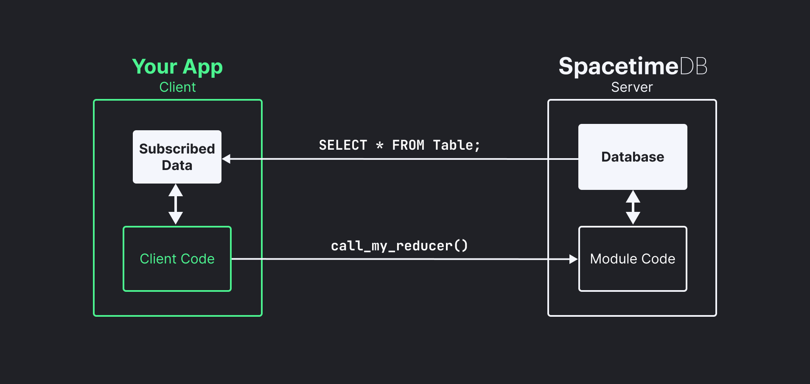

[English](README.md) | [العربية](README.ar.md)

<p align="center">
    <a href="https://spacetimedb.com#gh-dark-mode-only" target="_blank">
	
    </a>
    <a href="https://spacetimedb.com#gh-light-mode-only" target="_blank">
	
    </a>
</p>
<p align="center">
    <a href="https://spacetimedb.com#gh-dark-mode-only" target="_blank">
        
    </a>
    <a href="https://spacetimedb.com#gh-light-mode-only" target="_blank">
        
    </a>
    <h3 align="center">
        التطوير بسرعة الضوء.
    </h3>
</p>
<p align="center">
    <a href="https://github.com/clockworklabs/spacetimedb"></a>
    &nbsp;
    <a href="https://github.com/clockworklabs/spacetimedb"></a>
    &nbsp;
	<a href="https://github.com/clockworklabs/spacetimedb/actions"></a>
    &nbsp;
    <a href="https://status.spacetimedb.com"></a>
    &nbsp;
    <a href="https://hub.docker.com/r/clockworklabs/spacetimedb"></a>
    &nbsp;
    <a href="https://github.com/clockworklabs/spacetimedb/blob/master/LICENSE.txt"></a>
</p>
<p align="center">
    <a href="https://crates.io/crates/spacetimedb"></a>
    &nbsp;
    <a href="https://www.nuget.org/packages/SpacetimeDB.Runtime"></a>
    &nbsp;
    <a href="https://www.npmjs.com/package/spacetimedb"></a>
</p>
<p align="center">
    <a href="https://discord.gg/spacetimedb"></a>
    &nbsp;
    <a href="https://twitter.com/spacetimedb"></a>
    &nbsp;
    <a href="https://clockworklabs.io/join"></a>
    &nbsp;
    <a href="https://www.linkedin.com/company/clockworklabs/"></a>
</p>

<p align="center">
    <a href="https://discord.gg/spacetimedb"></a>
    &nbsp;
    <a href="https://twitter.com/spacetimedb"></a>
    &nbsp;
    <a href="https://github.com/clockworklabs/spacetimedb"></a>
    &nbsp;
    <a href="https://twitch.tv/SpacetimeDB"></a>
    &nbsp;
    <a href="https://youtube.com/@SpacetimeDB"></a>
    &nbsp;
    <a href="https://www.linkedin.com/company/clockwork-labs/"></a>
    &nbsp;
    <a href="https://stackoverflow.com/questions/tagged/spacetimedb"></a>
</p>

<br>

## ما هي SpacetimeDB؟

**SpacetimeDB** هي قاعدة بيانات علائقية وتعمل كخادم في الوقت نفسه. يمكنك رفع منطق تطبيقك مباشرةً إلى داخل قاعدة البيانات، ويتصل العملاء بها مباشرةً دون الحاجة إلى أي خادم وسيط.

اكتب مخطط البيانات (Schema) ومنطق العمل كوحدة برمجية (**Module**) بلغة [Rust](https://spacetimedb.com/docs/quickstarts/rust)، أو [C#](https://spacetimedb.com/docs/quickstarts/c-sharp), أو [TypeScript](https://spacetimedb.com/docs/quickstarts/typescript)، أو [C++](https://spacetimedb.com/docs/quickstarts/c-plus-plus). تقوم SpacetimeDB بترجمتها وتشغيلها داخل قاعدة البيانات، ومزامنة الحالة تلقائياً مع العملاء المتصلين في الوقت الفعلي.

بدلاً من نشر خادم ويب أو خادم ألعاب يتوسط بين عملائك وقاعدة بياناتك، يتصل العملاء بقاعدة البيانات مباشرةً وينفذون منطق تطبيقك داخل وحدتك البرمجية. يمكنك كتابة كامل منطق الأذونات والمصادقة داخل وحدتك البرمجية تماماً كما تفعل في أي خادم تقليدي.

هذا يعني أنه يمكنك كتابة كامل تطبيقك بلغة واحدة ونشره كملف تنفيذي واحد (Single Binary). وداعاً لخوادم الويب المنفصلة، والحاويات (Containers)، ومجموعات Kubernetes، والأجهزة الافتراضية (VMs)، وعمليات DevOps المعقدة، وطبقات التخزين المؤقت (Caching Layers). بنية تحتية تدار بالكامل بصفر مجهود.

<figure>
    
    <figcaption align="center">
        <p align="center"><b>بنية تطبيقات SpacetimeDB المعمارية</b><br /><sup><sub>(العناصر باللون الأبيض توفرها SpacetimeDB)</sub></sup></p>
    </figcaption>
</figure>

تم تحسين SpacetimeDB لتحقيق أقصى سرعة وأقل زمن استجابة (Latency). توفر SpacetimeDB كافة ضمانات ACID لقواعد البيانات العلائقية التقليدية، مع سرعة تماثل خوادم الويب فائقة التحسين. يتم الاحتفاظ بجميع حالات التطبيق في الذاكرة (In-Memory) للوصول السريع، بينما يوفّر سجل الإيداع (Commit Log) على القرص الاستمرارية والتعافي التام من الأعطال. تعمل الواجهة الخلفية الكاملة للعبتنا الجماعية الضخمة [BitCraft Online](https://bitcraftonline.com) كوحدة برمجية واحدة على SpacetimeDB: الدردشة، العناصر، التضاريس، مواقع اللاعبين، وكل شيء، متزامناً مع آلاف اللاعبين في الوقت الفعلي.

## البدء السريع

### 1. التثبيت

```bash
# لنظامي macOS / Linux
curl -sSf https://install.spacetimedb.com | sh

# لنظام Windows (عبر PowerShell)
iwr https://windows.spacetimedb.com -useb | iex
```

### 2. تسجيل الدخول

```bash
spacetime login
```

سيؤدي هذا الأمر إلى فتح المتصفح للمصادقة عبر GitHub. ترتبط هويتك بحسابك حتى تتمكن من نشر قواعد البيانات.

### 3. بدء التطوير

```bash
spacetime dev --template chat-react-ts
```

هذا كل شيء! يقوم هذا الأمر بإنشاء مشروع من قالب جاهز، ونشره على [Maincloud](https://spacetimedb.com/docs/how-to/deploy/maincloud)، ومراقبة التغييرات في الملفات، وإعادة البناء والنشر تلقائياً فور الحفظ. راجع [صفحة الأسعار](https://spacetimedb.com/pricing) لمعرفة التفاصيل.

## كيف تعمل؟

تحدد وحدات SpacetimeDB البرمجية **الجداول** (بياناتك) و**دوال الاختزال / المعالجة (Reducers)** (منطق عملك). يتصل العملاء، ويستدعون دوال الاختزال، ويشتركون في الجداول. عندما تتغير البيانات، تدفع SpacetimeDB التحديثات تلقائياً إلى العملاء المشتركين.

```rust
// تعريف جدول
#[spacetimedb::table(accessor = messages, public)]
pub struct Message {
    #[primary_key]
    #[auto_inc]
    id: u64,
    sender: Identity,
    text: String,
}

// تعريف دالة اختزال (نقطة نهاية API الخاصة بك)
#[spacetimedb::reducer]
pub fn send_message(ctx: &ReducerContext, text: String) {
    ctx.db.messages().insert(Message {
        id: 0,
        sender: ctx.sender,
        text,
    });
}
```

في جانب العميل، اشترك في البيانات واحصل على التحديثات الحية:

```typescript
const [messages] = useTable(tables.message);
// يتم تحديث messages تلقائياً عند تغير حالة الخادم.
// دون استقصاء دوري (No polling). دون إعادة جلب يدوي (No refetching).
```

## دعم اللغات

### وحدات الخادم البرمجية (Server Modules)

اكتب منطق قاعدة بياناتك بأي من هذه اللغات:

| اللغة | دليل البدء السريع |
|----------|-----------|
| **Rust** | [ابدأ الآن](https://spacetimedb.com/docs/quickstarts/rust) |
| **C#** | [ابدأ الآن](https://spacetimedb.com/docs/quickstarts/c-sharp) |
| **TypeScript** | [ابدأ الآن](https://spacetimedb.com/docs/quickstarts/typescript) |
| **C++** | [ابدأ الآن](https://spacetimedb.com/docs/quickstarts/c-plus-plus) |

### حزم تطوير العميل (Client SDKs)

اتصل بقاعدة البيانات من أي من هذه المنصات والبيئات:

| حزمة SDK | دليل البدء السريع |
|-----|-----------|
| **TypeScript** (React, Next.js, Vue, Svelte, Angular, Node.js, Bun, Deno) | [ابدأ الآن](https://spacetimedb.com/docs/quickstarts/react) |
| **Rust** | [ابدأ الآن](https://spacetimedb.com/docs/quickstarts/rust) |
| **C#** (مستقل وعبر Unity) | [ابدأ الآن](https://spacetimedb.com/docs/quickstarts/c-sharp) |
| **C++** (محرك Unreal Engine) | [ابدأ الآن](https://spacetimedb.com/docs/quickstarts/c-plus-plus) |

## التشغيل باستخدام Docker

```bash
docker run --rm --pull always -p 3000:3000 clockworklabs/spacetime start
```

## البناء من المصدر

إذا كنت بحاجة إلى ميزات من فرع `master` لم يتم إصدارها بعد:

```bash
# المتطلبات الأساسية: سلسلة أدوات Rust مع هدف wasm32-unknown-unknown
curl https://sh.rustup.rs -sSf | sh

git clone https://github.com/clockworklabs/SpacetimeDB
cd SpacetimeDB
cargo build --locked --release -p spacetimedb-standalone -p spacetimedb-update -p spacetimedb-cli
```

ثم قم بتثبيت الملفات التنفيذية:

<details>
<summary>macOS / Linux</summary>

```bash
mkdir -p ~/.local/bin
STDB_VERSION="$(./target/release/spacetimedb-cli --version | sed -n 's/.*spacetimedb tool version \([0-9.]*\);.*/\1/p')"
mkdir -p ~/.local/share/spacetime/bin/$STDB_VERSION

cp target/release/spacetimedb-update ~/.local/bin/spacetime
cp target/release/spacetimedb-cli ~/.local/share/spacetime/bin/$STDB_VERSION
cp target/release/spacetimedb-standalone ~/.local/share/spacetime/bin/$STDB_VERSION

# أضف المسار إلى إعدادات الغلاف (shell) إذا لم يكن مضافاً بالفعل:
export PATH="$HOME/.local/bin:$PATH"

# عيّن الإصدار النشط:
spacetime version use $STDB_VERSION
```
</details>

<details>
<summary>Windows (PowerShell)</summary>

```powershell
$stdbDir = "$HOME\AppData\Local\SpacetimeDB"
$stdbVersion = & ".\target\release\spacetimedb-cli" --version |
    Select-String -Pattern 'spacetimedb tool version ([0-9.]+);' |
    ForEach-Object { $_.Matches.Groups[1].Value }
New-Item -ItemType Directory -Path "$stdbDir\bin\$stdbVersion" -Force | Out-Null

Copy-Item "target\release\spacetimedb-update.exe" "$stdbDir\spacetime.exe"
Copy-Item "target\release\spacetimedb-cli.exe" "$stdbDir\bin\$stdbVersion\"
Copy-Item "target\release\spacetimedb-standalone.exe" "$stdbDir\bin\$stdbVersion\"

# أضف المسار التالي إلى متغير PATH في نظامك: %USERPROFILE%\AppData\Local\SpacetimeDB
# ثم في نافذة سطر أوامر جديدة:
spacetime version use $stdbVersion
```
</details>

تحقق من نجاح التثبيت عبر الأمر: `spacetime --version`.

## التوثيق

لإعداد بيئة البرمجة المدعومة بالذكاء الاصطناعي، اتبع [دليل إعداد الوكيل الذكي (Agent Setup Guide)](docs/static/agent-setup.md).

يتوفر التوثيق الكامل عبر الموقع الرسمي **[spacetimedb.com/docs](https://spacetimedb.com/docs)**، ويتضمن:

- [أدلة البدء السريع](https://spacetimedb.com/docs) لكل لغة وإطار عمل مدعوم.
- [المفاهيم الأساسية](https://spacetimedb.com/docs/core-concepts): الجداول، دوال الاختزال (Reducers)، الاشتراكات، والمصادقة.
- [الدروس التعليمية](https://spacetimedb.com/docs/tutorials/chat-app): تطبيق دردشة، ألعاب متعددة اللاعبين على Unity، ألعاب متعددة اللاعبين على Unreal Engine.
- [دليل النشر السحابي](https://spacetimedb.com/docs/how-to/deploy/maincloud): النشر على سحابة Maincloud.
- [دليل واجهة سطر الأوامر (CLI Reference)](https://spacetimedb.com/docs/cli-reference).
- [دليل لغة SQL](https://spacetimedb.com/docs/reference/sql/).

## الترخيص

تخضع SpacetimeDB لترخيص [Business Source License 1.1 (BSL)](LICENSE.txt). يتحول هذا الترخيص تلقائياً إلى رخصة AGPL v3.0 مع استثناء الربط (Linking Exception) بعد بضع سنوات. يعني استثناء الربط أنك **لست** ملزماً بجعل كود تطبيقك الخاص مفتوح المصدر إذا كنت تستخدم SpacetimeDB، بل يلزمك فقط المساهمة بالتعديلات التي تجريها على SpacetimeDB نفسها.

**لماذا اخترنا هذا الترخيص؟**
اخترنا ترخيص SpacetimeDB بموجب ترخيص MariaDB Business Source License لمدة 4 سنوات لأننا لا نستطيع منافسة الخدمات السحابية العملاقة مثل AWS بينما نبني منتجاتنا لهم في الوقت نفسه.

واخترنا ترخيص GPLv3 مع استثناء الربط ليكون رخصة المصدر المفتوح لأننا نرغب في دمج المساهمات في الفرع الرئيسي للمشروع (تماماً كما يحدث في نواة Linux)، ولكن دون إجبار أي شخص آخر على جعل كوده الخاص مفتوح المصدر (وهو ما يحققه استثناء الربط).
