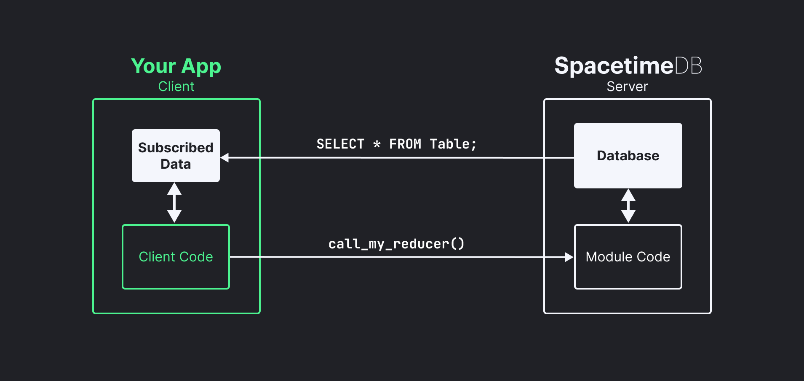

<p align="center">
    <a href="https://spacetimedb.com#gh-dark-mode-only" target="_blank">
	
    </a>
    <a href="https://spacetimedb.com#gh-light-mode-only" target="_blank">
	
    </a>
</p>
<p align="center">
    <a href="https://spacetimedb.com#gh-dark-mode-only" target="_blank">
        
    </a>
    <a href="https://spacetimedb.com#gh-light-mode-only" target="_blank">
        
    </a>
    <h3 align="center">
        Multiplayer at the speed of light.
    </h3>
</p>
<p align="center">
    <a href="https://github.com/clockworklabs/spacetimedb"></a>
    &nbsp;
    <a href="https://github.com/clockworklabs/spacetimedb"></a>
    &nbsp;
	<a href="https://github.com/clockworklabs/spacetimedb/actions"></a>
    &nbsp;
    <a href="https://status.spacetimedb.com"></a>
    &nbsp;
    <a href="https://hub.docker.com/r/clockworklabs/spacetimedb"></a>
    &nbsp;
    <a href="https://github.com/clockworklabs/spacetimedb/blob/master/LICENSE.txt"></a>
</p>

<p align="center">
    <a href="https://discord.gg/spacetimedb"></a>
    &nbsp;
    <a href="https://twitter.com/spacetime_db"></a>
    &nbsp;
    <a href="https://clockworklabs.io/join"></a>
    &nbsp;
    <a href="https://www.linkedin.com/company/clockworklabs/"></a>
</p>

<p align="center">
    <a href="https://discord.gg/spacetimedb"></a>
    &nbsp;
    <a href="https://twitter.com/spacetime_db"></a>
    &nbsp;
    <a href="https://github.com/clockworklabs/spacetimedb"></a>
    &nbsp;
    <a href="https://twitch.tv/SpacetimeDB"></a>
    &nbsp;
    <a href="https://youtube.com/@SpacetimeDB"></a>
    &nbsp;
    <a href="https://www.linkedin.com/company/clockwork-labs/"></a>
    &nbsp;
    <a href="https://stackoverflow.com/questions/tagged/spacetimedb"></a>
</p>

<br>

## What is [SpacetimeDB](https://spacetimedb.com)?

You can think of SpacetimeDB as both a database and server combined into one.

It is a relational database system that lets you upload your application logic directly into the database by way of fancy stored procedures called "modules."

Instead of deploying a web or game server that sits in between your clients and your database, your clients connect directly to the database and execute your application logic inside the database itself. You can write all of your permission and authorization logic right inside your module just as you would in a normal server.

This means that you can write your entire application in a single language, Rust, and deploy it as a single binary. No more microservices, no more containers, no more Kubernetes, no more Docker, no more VMs, no more DevOps, no more infrastructure, no more ops, no more servers.

<figure>
    
    <figcaption align="center">
        <p align="center"><b>SpacetimeDB application architecture</b><br /><sup><sub>(elements in white are provided by SpacetimeDB)</sub></sup></p>
    </figcaption>
</figure>

It's actually similar to the idea of smart contracts, except that SpacetimeDB is a database, has nothing to do with blockchain, and is orders of magnitude faster than any smart contract system.

So fast, in fact, that the entire backend of our MMORPG [BitCraft Online](https://bitcraftonline.com) is just a SpacetimeDB module. We don't have any other servers or services running, which means that everything in the game, all of the chat messages, items, resources, terrain, and even the locations of the players are stored and processed by the database before being synchronized out to all of the clients in real-time.

SpacetimeDB is optimized for maximum speed and minimum latency rather than batch processing or OLAP workloads. It is designed to be used for real-time applications like games, chat, and collaboration tools.

This speed and latency is achieved by holding all of application state in memory, while persisting the data in a write-ahead-log (WAL) which is used to recover application state.

## Installation

SpacetimeDB is an embedded database library that you can use to extend your own applications. You can also run SpacetimeDB as a standalone database server via the `spacetime` CLI tool.

You can install and run the `spacetime` CLI tool via Cargo, Homebrew, Docker, or by downloading the binary directly from our website.


#### Install on macOS

You can install SpacetimeDB on macOS using Homebrew. This will install the `spacetime` CLI tool and the SpacetimeDB standalone server as a single executable. You can also install on macOS using the Linux instructions below.

```bash
brew install clockworklabs/tap/spacetime
```

#### Install on Linux

Installing SpacetimeDB on Linux (or other Unix operating systems) is as easy as downloading the binary and running it. You can also install on Linux using the Docker instructions below.

```bash
curl --proto '=https' --tlsv1.2 -sSf https://install.spacetimedb.com | sh
```

#### Install on Windows

Run the following command in your terminal and follow the on-screen instructions to install the `spacetime` CLI tool and the SpacetimeDB standalone server as a single executable.

```ps1
iwr https://windows.spacetimedb.com -useb | iex
```

#### Install with Cargo

If you'd like to build the `spacetime` CLI tool from source, you can install it using Cargo.

```bash
cargo install spacetimedb-cli
```

### Installing from Source

For MacOS and Linux this is straightforward. Just run the following commands in a terminal:

```bash
# Install rustup, you can skip this step if you have cargo and the wasm32-unknown-unknown target already installed.
curl https://sh.rustup.rs -sSf | sh
# Clone SpacetimeDB
git clone https://github.com/clockworklabs/SpacetimeDB
# Build and install the CLI
cd SpacetimeDB
cargo install --path ./crates/cli --locked
```

Windows may require some extra dependencies be installed, including openssl and a specific version of perl. A guide for this will be available soon.

#### Running with Docker

You can execute the `spacetime` CLI tool using Docker to run the SpacetimeDB standalone server without needing to install any command-line tools or other dependencies.

```bash
docker run --rm --pull always --name spacetimedb -p 3000:80 clockworklabs/spacetimedb:latest start
```

## Documentation

For more information about SpacetimeDB, getting started guides, game development guides, and reference material please see our [documentation](https://spacetimedb.com/docs).

## Getting Started

We've prepared several getting started guides in each of our supported languages to help you get up and running with SpacetimeDB as quickly as possible. You can find them on our [docs page](https://spacetimedb.com/docs).

In summary there are only 4 steps to getting started with SpacetimeDB.

1. Install the `spacetime` CLI tool.
2. Start a SpacetimeDB standalone node with `spacetime start`.
3. Write and upload a module in one of our supported module languages.
4. Connect to the database with one of our client libraries.

You can see a summary of the supported languages below with a link to the getting started guide for each.

## Language Support

You can write SpacetimeDB modules in a bunch of popular languages, with many more to come in the future!

#### Serverside Libraries

- [Rust](https://spacetimedb.com/docs/modules/rust/quickstart)
- [C# (experimental)](https://spacetimedb.com/docs/modules/c-sharp/quickstart)
- Typescript (coming soon)
- Python (coming soon)
- C++ (planned)
- Lua (planned)

#### Client Libraries

- [Rust](https://spacetimedb.com/docs/sdks/rust/quickstart)
- [C#](https://spacetimedb.com/docs/sdks/c-sharp/quickstart)
- [Typescript](https://spacetimedb.com/docs/sdks/typescript/quickstart)
- [Python](https://spacetimedb.com/docs/sdks/python/quickstart)
- C++ (planned)
- Lua (planned)

## License

SpacetimeDB is licensed under the BSL 1.1 license. This is not an open source or free software license, however, it converts to the AGPL v3.0 license with a linking exception after a few years.

Note that the AGPL v3.0 does not typically include a linking exception. We have added a custom linking exception to the AGPL license for SpacetimeDB. Our motivation for choosing a free software license is to ensure that contributions made to SpacetimeDB are propagated back to the community. We are expressly not interested in forcing users of SpacetimeDB to open source their own code if they link with SpacetimeDB, so we needed to include a linking exception.
