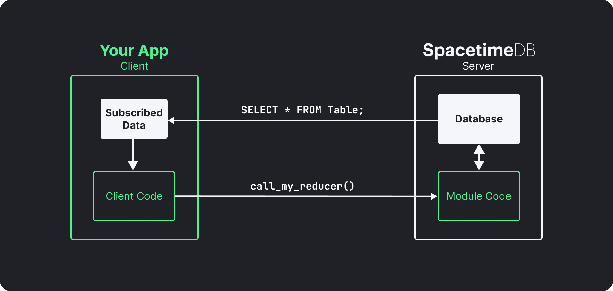

<p align="center">
    <a href="https://spacetimedb.com#gh-dark-mode-only" target="_blank">
	
    </a>
    <a href="https://spacetimedb.com#gh-light-mode-only" target="_blank">
	
    </a>
</p>
<p align="center">
    <a href="https://spacetimedb.com#gh-dark-mode-only" target="_blank">
        
    </a>
    <a href="https://spacetimedb.com#gh-light-mode-only" target="_blank">
        
    </a>
    <h3 align="center">
        Development at the speed of light.
    </h3>
</p>
<p align="center">
    <a href="https://github.com/clockworklabs/spacetimedb"></a>
    &nbsp;
    <a href="https://github.com/clockworklabs/spacetimedb"></a>
    &nbsp;
	<a href="https://github.com/clockworklabs/spacetimedb/actions"></a>
    &nbsp;
    <a href="https://status.spacetimedb.com"></a>
    &nbsp;
    <a href="https://hub.docker.com/r/clockworklabs/spacetimedb"></a>
    &nbsp;
    <a href="https://github.com/clockworklabs/spacetimedb/blob/master/LICENSE.txt"></a>
</p>
<p align="center">
    <a href="https://crates.io/crates/spacetimedb"></a>
    &nbsp;
    <a href="https://www.nuget.org/packages/SpacetimeDB.Runtime"></a>
    &nbsp;
    <a href="https://www.npmjs.com/package/@clockworklabs/spacetimedb-sdk"></a>
</p>
<p align="center">
    <a href="https://discord.gg/spacetimedb"></a>
    &nbsp;
    <a href="https://twitter.com/spacetime_db"></a>
    &nbsp;
    <a href="https://clockworklabs.io/join"></a>
    &nbsp;
    <a href="https://www.linkedin.com/company/clockworklabs/"></a>
</p>

<p align="center">
    <a href="https://discord.gg/spacetimedb"></a>
    &nbsp;
    <a href="https://twitter.com/spacetime_db"></a>
    &nbsp;
    <a href="https://github.com/clockworklabs/spacetimedb"></a>
    &nbsp;
    <a href="https://twitch.tv/SpacetimeDB"></a>
    &nbsp;
    <a href="https://youtube.com/@SpacetimeDB"></a>
    &nbsp;
    <a href="https://www.linkedin.com/company/clockwork-labs/"></a>
    &nbsp;
    <a href="https://stackoverflow.com/questions/tagged/spacetimedb"></a>
</p>

<br>

## What is SpacetimeDB?

SpacetimeDB is a database that is also a server. You upload your application logic directly into the database, and clients connect to it without any server in between.

Write your schema and business logic as a **module** in [Rust](https://spacetimedb.com/docs/quickstarts/rust), [C#](https://spacetimedb.com/docs/quickstarts/c-sharp), [TypeScript](https://spacetimedb.com/docs/quickstarts/typescript), or [C++](https://spacetimedb.com/docs/quickstarts/cpp). SpacetimeDB compiles it, runs it inside the database, and automatically synchronizes state to connected clients in real-time.

No separate web server. No REST API. No caching layer. No infrastructure to manage.

<figure>
    
    <figcaption align="center">
        <p align="center"><b>SpacetimeDB application architecture</b><br /><sup><sub>(elements in white are provided by SpacetimeDB)</sub></sup></p>
    </figcaption>
</figure>

SpacetimeDB is optimized for maximum speed and minimum latency. All application state is held in memory for fast access, while a commit log on disk provides durability and crash recovery. The entire backend of our MMORPG [BitCraft Online](https://bitcraftonline.com) runs as a single SpacetimeDB module: chat, items, terrain, player positions, everything, synchronized to thousands of players in real-time.

## Quick Start

### 1. Install

```bash
# macOS / Linux
curl -sSf https://install.spacetimedb.com | sh

# Windows (PowerShell)
iwr https://windows.spacetimedb.com -useb | iex
```

### 2. Log in

```bash
spacetime login
```

This opens a browser to authenticate with GitHub. Your identity is linked to your account so you can publish databases.

### 3. Create a project

```bash
spacetime init --lang rust my-project
cd my-project
```

Supported module languages: `rust`, `csharp`, `typescript`, `cpp`

### 4. Develop locally

```bash
spacetime dev
```

This starts a local SpacetimeDB instance, publishes your module, watches for file changes, and automatically rebuilds and republishes on save.

### 5. Publish to the cloud

```bash
spacetime publish my-database
```

This deploys your module to [Maincloud](https://spacetimedb.com/docs/how-to/deploy/maincloud), the fully managed SpacetimeDB cloud. It scales to zero when idle and you only pay for what you use. See [pricing](https://spacetimedb.com/pricing) for details.

## How It Works

SpacetimeDB modules define **tables** (your data) and **reducers** (your logic). Clients connect, call reducers, and subscribe to tables. When data changes, SpacetimeDB pushes updates to subscribed clients automatically.

```rust
// Define a table
#[spacetimedb::table(accessor = messages, public)]
pub struct Message {
    #[primary_key]
    #[auto_inc]
    id: u64,
    sender: Identity,
    text: String,
}

// Define a reducer (your API endpoint)
#[spacetimedb::reducer]
pub fn send_message(ctx: &ReducerContext, text: String) {
    ctx.db.messages().insert(Message {
        id: 0,
        sender: ctx.sender,
        text,
    });
}
```

On the client side, subscribe and get live updates:

```typescript
const [messages] = useTable(tables.message);
// messages updates automatically when the server state changes.
// No polling. No refetching.
```

## Language Support

### Server Modules

Write your database logic in any of these languages:

| Language | Quickstart |
|----------|-----------|
| **Rust** | [Get started](https://spacetimedb.com/docs/quickstarts/rust) |
| **C#** | [Get started](https://spacetimedb.com/docs/quickstarts/c-sharp) |
| **TypeScript** | [Get started](https://spacetimedb.com/docs/quickstarts/typescript) |
| **C++** | [Get started](https://spacetimedb.com/docs/quickstarts/cpp) |

### Client SDKs

Connect from any of these platforms:

| SDK | Quickstart |
|-----|-----------|
| **TypeScript** (React, Next.js, Vue, Svelte, Angular, Node.js, Bun, Deno) | [Get started](https://spacetimedb.com/docs/quickstarts/react) |
| **Rust** | [Get started](https://spacetimedb.com/docs/quickstarts/rust) |
| **C#** (standalone and Unity) | [Get started](https://spacetimedb.com/docs/quickstarts/c-sharp) |
| **C++** (Unreal Engine) | [Get started](https://spacetimedb.com/docs/quickstarts/cpp) |

## Running with Docker

```bash
docker run --rm --pull always -p 3000:3000 clockworklabs/spacetime start
```

## Building from Source

If you need features from `master` that have not been released yet:

```bash
# Prerequisites: Rust toolchain with wasm32-unknown-unknown target
curl https://sh.rustup.rs -sSf | sh

git clone https://github.com/clockworklabs/SpacetimeDB
cd SpacetimeDB
cargo build --locked --release -p spacetimedb-standalone -p spacetimedb-update -p spacetimedb-cli
```

Then install the binaries:

<details>
<summary>macOS / Linux</summary>

```bash
mkdir -p ~/.local/bin
STDB_VERSION="$(./target/release/spacetimedb-cli --version | sed -n 's/.*spacetimedb tool version \([0-9.]*\);.*/\1/p')"
mkdir -p ~/.local/share/spacetime/bin/$STDB_VERSION

cp target/release/spacetimedb-update ~/.local/bin/spacetime
cp target/release/spacetimedb-cli ~/.local/share/spacetime/bin/$STDB_VERSION
cp target/release/spacetimedb-standalone ~/.local/share/spacetime/bin/$STDB_VERSION

# Add to your shell config if not already present:
export PATH="$HOME/.local/bin:$PATH"

# Set the active version:
spacetime version use $STDB_VERSION
```
</details>

<details>
<summary>Windows (PowerShell)</summary>

```powershell
$stdbDir = "$HOME\AppData\Local\SpacetimeDB"
$stdbVersion = & ".\target\release\spacetimedb-cli" --version |
    Select-String -Pattern 'spacetimedb tool version ([0-9.]+);' |
    ForEach-Object { $_.Matches.Groups[1].Value }
New-Item -ItemType Directory -Path "$stdbDir\bin\$stdbVersion" -Force | Out-Null

Copy-Item "target\release\spacetimedb-update.exe" "$stdbDir\spacetime.exe"
Copy-Item "target\release\spacetimedb-cli.exe" "$stdbDir\bin\$stdbVersion\"
Copy-Item "target\release\spacetimedb-standalone.exe" "$stdbDir\bin\$stdbVersion\"

# Add to your system PATH: %USERPROFILE%\AppData\Local\SpacetimeDB
# Then in a new shell:
spacetime version use $stdbVersion
```
</details>

Verify with `spacetime --version`.

## Documentation

Full documentation is available at **[spacetimedb.com/docs](https://spacetimedb.com/docs)**, including:

- [Quickstart guides](https://spacetimedb.com/docs) for every supported language and framework
- [Core concepts](https://spacetimedb.com/docs/core-concepts): tables, reducers, subscriptions, authentication
- [Tutorials](https://spacetimedb.com/docs/tutorials/chat-app): chat app, Unity multiplayer, Unreal Engine multiplayer
- [Deployment guide](https://spacetimedb.com/docs/how-to/deploy/maincloud): publishing to Maincloud
- [CLI reference](https://spacetimedb.com/docs/reference/cli-reference)
- [SQL reference](https://spacetimedb.com/docs/reference/sql-reference)

## License

SpacetimeDB is licensed under the [Business Source License 1.1 (BSL)](LICENSE.txt). It converts to the AGPL v3.0 with a linking exception after a few years. The linking exception means you are **not** required to open-source your own code if you use SpacetimeDB. You only need to contribute back changes to SpacetimeDB itself.
