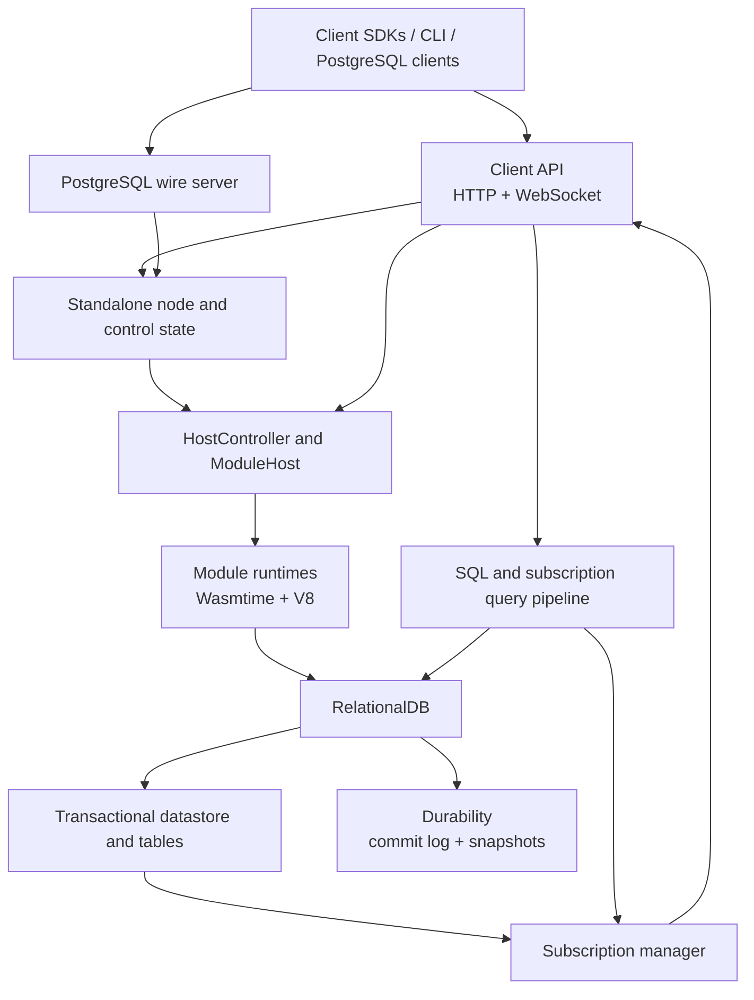

# SpacetimeDB codebase guide

This directory is an internal guide to the SpacetimeDB codebase: what the major
systems are, where they live, and how work moves between them. It complements
the [product documentation](../README.md); it is not a guide to using
SpacetimeDB as an application developer.

The repository is a Rust workspace surrounded by language bindings, client
SDKs, example modules, templates, tests, and release tooling. The most useful
way to approach it is as a set of layers around a running database rather than
as a list of crates.

## The short version

A SpacetimeDB node accepts HTTP, WebSocket, and PostgreSQL-wire requests. Each
deployed database has a **module host**, which runs the application's module and
owns access to a **relational database**. Reducers execute inside transactions.
Committed row changes are persisted and are also evaluated against live
subscriptions, producing updates for connected clients.



The arrows show the main conceptual relationships, not a strict crate
dependency graph. In particular, orchestration and subscription runtime code
currently share the `spacetimedb-core` crate.

## Major systems

| System | Responsibility | Start here |
| --- | --- | --- |
| Node assembly | Builds a runnable single-node server, owns local control-plane state, configuration, routing, and process lifecycle. | [`crates/standalone`](../../crates/standalone), especially [`StandaloneEnv`](../../crates/standalone/src/lib.rs) and the [`start` subcommand](../../crates/standalone/src/subcommands/start.rs) |
| Client API | Defines the public HTTP and WebSocket surface, authentication middleware, database routes, SQL calls, and connection setup. It uses delegate traits so the API is not tied to one node implementation. | [`crates/client-api`](../../crates/client-api), [`routes`](../../crates/client-api/src/routes/mod.rs), and [`subscribe`](../../crates/client-api/src/routes/subscribe.rs) |
| Module hosting | Creates and supervises database/module pairs, runs modules in Wasmtime or V8, invokes reducers and procedures, applies module updates, and manages scheduled work. | [`crates/core/src/host`](../../crates/core/src/host), starting with [`HostController`](../../crates/core/src/host/host_controller.rs) and [`ModuleHost`](../../crates/core/src/host/module_host.rs) |
| Database engine | Presents a relational database over the transactional datastore and coordinates recovery, system tables, commits, durability, snapshots, resource accounting, and schema updates. | [`crates/engine`](../../crates/engine), especially [`RelationalDB`](../../crates/engine/src/relational_db.rs) |
| Transactions and storage | Implements transaction state, committed state, sequences, system tables, scans, indexes, and the in-memory table representation. | [`crates/datastore`](../../crates/datastore) and [`crates/table`](../../crates/table) |
| Persistence | Records transaction history, tracks durable offsets, restores state, and periodically captures snapshots. | [`crates/durability`](../../crates/durability), [`crates/commitlog`](../../crates/commitlog), and [`crates/snapshot`](../../crates/snapshot) |
| Query engine | Parses SQL, produces logical expressions and physical plans, optimizes them, and executes them against datastore interfaces. | [`crates/sql-parser`](../../crates/sql-parser), [`expr`](../../crates/expr), [`query`](../../crates/query), [`physical-plan`](../../crates/physical-plan), and [`execution`](../../crates/execution) |
| Subscriptions | Compiles subscription queries for incremental evaluation, consumes transaction deltas, and sends matching row changes to connected clients. | [`crates/subscription`](../../crates/subscription) for compilation/evaluation and [`crates/core/src/subscription`](../../crates/core/src/subscription) for lifecycle and delivery |
| Schema and shared types | Defines module schemas, migrations, algebraic types and values, wire encodings, identities, IDs, and other concepts shared across layers. | [`crates/schema`](../../crates/schema), [`sats`](../../crates/sats), [`lib`](../../crates/lib), and [`primitives`](../../crates/primitives) |
| Bindings and SDKs | Exposes module APIs, generates client code, defines client protocol messages, and implements language-specific clients. | [`crates/bindings`](../../crates/bindings), [`crates/codegen`](../../crates/codegen), [`crates/client-api-messages`](../../crates/client-api-messages), and [`sdks`](../../sdks) |
| Runtime abstraction | Wraps task execution, time, randomness, and synchronization so core code can run on Tokio or under deterministic simulation. | [`crates/runtime`](../../crates/runtime) and [`crates/runtime-core`](../../crates/runtime-core) |

## Important flows

### Starting a node and opening a database

1. The `spacetimedb-standalone` binary parses configuration and creates a
   [`StandaloneEnv`](../../crates/standalone/src/lib.rs).
2. `StandaloneEnv` opens its local control database, initializes program
   storage and persistence, creates a
   [`HostController`](../../crates/core/src/host/host_controller.rs), and
   installs the client API routes.
3. A request for a database is resolved through control state to its leader
   replica. In standalone mode there is one local replica.
4. The host controller launches the replica's module host if necessary.
5. [`RelationalDB::open`](../../crates/engine/src/relational_db.rs) restores a
   suitable snapshot, replays later durable history, validates database
   metadata, and exposes the reconstructed in-memory state to the module host.

The distinction between **control state** and **database state** matters.
Control state describes nodes, databases, replicas, names, ownership, and
placement. Database state is the application and system-table data inside a
specific replica.

### Publishing or updating a module

1. A publish request enters through the database routes in
   [`client-api`](../../crates/client-api/src/routes/database.rs).
2. The node's control-state implementation resolves whether this creates a new
   database or updates an existing one.
3. The host controller validates the program, extracts its module definition,
   compares schemas, and applies the selected migration policy.
4. Program bytes are stored by hash and the module host is created or replaced.
5. The module definition becomes the contract used by the runtime, database
   schema, subscriptions, and generated clients.

### Calling a reducer

1. A connected client sends a reducer call using the client protocol.
2. The client API authenticates the request and routes it to the database's
   module host.
3. The module host selects the Wasmtime or V8 runtime and invokes the reducer
   with its caller identity and connection context.
4. Module host calls into the database are performed inside a mutable
   transaction. The datastore maintains the tentative writes and indexes.
5. A successful reducer commits its transaction. A failed reducer or exhausted
   execution budget does not expose partial writes.
6. The commit is handed to durability and its row delta is handed to the
   subscription machinery. Callers that request confirmed results wait for the
   relevant durable transaction offset.

### Updating a subscription

Subscriptions are incrementally maintained queries, not periodically rerun
full table scans.

1. The query compiler parses and plans each subscription query.
2. [`spacetimedb-subscription`](../../crates/subscription/src/lib.rs) derives
   physical plan fragments that evaluate inserts and deletes against a
   transaction delta.
3. The module subscription manager indexes active subscriptions and determines
   which ones a committed transaction can affect.
4. Matching changes are encoded into protocol messages and delivered by the
   connection/subscription actors in `spacetimedb-core`.

This split explains why subscription code appears in two places:
`crates/subscription` contains query-oriented incremental evaluation, while
`crates/core/src/subscription` connects that evaluation to module hosts,
transactions, clients, and WebSocket delivery.

### Executing SQL

SQL enters through either the HTTP API or PostgreSQL wire protocol. The SQL
pipeline is spread across intentionally narrower crates:

```text
SQL text
  -> sql-parser
  -> expr (logical representation)
  -> query (typechecking, planning, optimization)
  -> physical-plan
  -> execution
  -> datastore transaction
```

The API-facing orchestration is in
[`core/src/sql`](../../crates/core/src/sql) and
[`Host::exec_sql`](../../crates/client-api/src/lib.rs). The PostgreSQL protocol
adapter lives in [`crates/pg`](../../crates/pg).

## Foundational boundaries

Several boundaries recur throughout the codebase:

- **Module definition versus runtime instance.** A module definition describes
  tables, reducers, procedures, views, indexes, and types. A runtime instance
  is the executable Wasm or JavaScript program serving one database.
- **Control plane versus data plane.** Control-plane code locates and manages a
  database. Data-plane code executes calls, transactions, queries, and
  subscriptions against it.
- **Committed versus durable.** A transaction can be committed to the live
  database before persistence has confirmed its offset. Confirmed reads and
  results explicitly wait at this boundary.
- **Full state versus transaction delta.** The datastore owns current state;
  subscriptions use inserted and deleted rows from a commit to maintain client
  views incrementally.
- **Protocol types versus storage types.** `client-api-messages` defines what
  crosses the network. SATS, schema, primitives, and table/datastore types
  describe values and data inside the server.
- **Production runtime versus simulated runtime.** Shared async code uses
  `spacetimedb-runtime` abstractions where deterministic scheduling, time, and
  randomness are required in tests.

## Repository map

The top-level directories have different audiences:

- [`crates`](../../crates) contains the Rust server, shared libraries, language
  bindings, code generators, tests, and command-line programs.
- [`sdks`](../../sdks) contains client SDK implementations that are maintained
  outside the core crates.
- [`modules`](../../modules) contains integration-test modules and benchmark
  workloads in the supported module languages.
- [`templates`](../../templates) contains complete starter applications used by
  the CLI.
- [`docs`](../../docs) contains public product documentation as well as this
  internal codebase guide.
- [`tools`](../../tools) contains CI, release, regeneration, binding-generation,
  and repository maintenance programs.
- [`demo`](../../demo) contains larger demonstration applications.

Within `crates`, package names are usually prefixed with `spacetimedb-`, while
directory names omit that prefix. Check a crate's `Cargo.toml` when searching by
a name seen in Rust imports.

## Where to begin a change

Start at the externally visible event, then follow it inward:

- For an HTTP endpoint or WebSocket handshake, begin in
  [`client-api/src/routes`](../../crates/client-api/src/routes).
- For reducer execution or module lifecycle, begin in
  [`core/src/host`](../../crates/core/src/host).
- For transaction semantics or system tables, begin in
  [`datastore`](../../crates/datastore), then descend into
  [`table`](../../crates/table) for physical row/index behavior.
- For commit, recovery, or on-disk behavior, begin in
  [`engine/src/relational_db.rs`](../../crates/engine/src/relational_db.rs), then
  follow calls into durability, commitlog, and snapshot.
- For SQL behavior, locate the stage that owns the bug: parsing, logical
  expression, planning, physical planning, or execution.
- For live-query behavior, distinguish compilation/evaluation in
  [`crates/subscription`](../../crates/subscription) from connection lifecycle
  and delivery in [`core/src/subscription`](../../crates/core/src/subscription).
- For generated APIs or a language-specific mismatch, trace from
  `client-api-messages` and schema through `codegen` into the relevant binding
  or SDK.

## Growing this guide

This page should remain the map, not become the territory. Add focused pages
for systems whose invariants, lifecycles, or interactions need more explanation,
and link them from the table above. Good early candidates are:

- module host lifecycle and module updates;
- transactions, commit, durability, and crash recovery;
- subscriptions from compilation through WebSocket delivery;
- the SQL planning and execution pipeline;
- schema representation and migration;
- client protocol versions and code generation;
- standalone control state and replica startup;
- deterministic simulation coverage.

When adding a page, prefer links to stable directories or important types over
exhaustive file lists. Record invariants and ownership boundaries, and call out
places where the conceptual system spans multiple crates.
