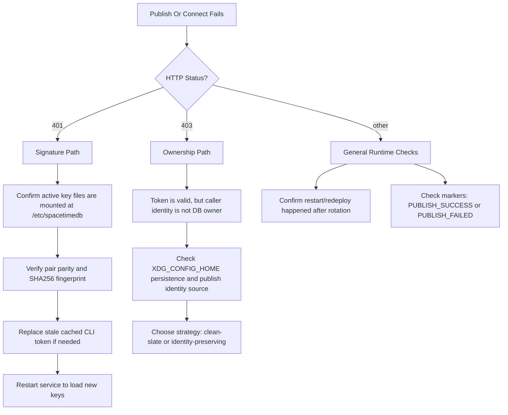

This guide explains how JWT signing key rotation works in self-hosted SpacetimeDB and how to avoid breaking `spacetime publish` during rotation.

## Assumptions and Risk Note

This guide assumes the following baseline:

- You operate 3 Azure VMs for hosted environments: `prod`, `test`, and `dev`.
- You may also run local development (`local`) outside those hosted VMs.
- You have current system-disk backups/snapshots before rotating keys or migrating data.

This guide shows one practical pattern that combines:

- Azure Key Vault for JWT key rotation and policy verification.
- `rsync` between hosts (`prod` -> `test` -> `dev`) for staged data migration/testing.

This pattern can be used in production, and many teams do so, but you should fully understand the operational risks before adopting it:

- key distribution and mount consistency across hosts,
- identity ownership constraints during publish,
- data consistency and rollback during host-to-host migration.

## Opinionated Setup (Reproducible Defaults)

This guide uses one strict path contract end-to-end:

- host source directory: `./.generated/spacetimedb-keys`
- host key files:
  - `./.generated/spacetimedb-keys/id_ecdsa`
  - `./.generated/spacetimedb-keys/id_ecdsa.pub`
- runtime mount target: `/etc/spacetimedb`
- runtime key files:
  - `/etc/spacetimedb/id_ecdsa`
  - `/etc/spacetimedb/id_ecdsa.pub`

Environment mapping for this guide:

- `prod` -> `azvmprod`
- `test` -> `azvmtest`
- `dev` -> `azvmdev`
- optional `local` for local workstation workflows

Operational defaults in this guide:

- run rotation with `just kv-rotate-jwt-keys ENV=prod` (or `ENV=test|dev|local`),
- keep token-preservation enabled,
- keep mounted-key sync enabled (writes to `./.generated/spacetimedb-keys`),
- mount `./.generated/spacetimedb-keys` read-only into `/etc/spacetimedb`,
- use one tooling surface (single script is fine) that supports rotate, verify, and token re-sign workflows.

## Quickstart Scaffold

Use this first if you want a fast bootstrap in a new repo.

### 1) Generate a compatible keypair

```sh
mkdir -p ./.generated/spacetimedb-keys
openssl genpkey -algorithm EC -pkeyopt ec_paramgen_curve:prime256v1 -out ./.generated/spacetimedb-keys/id_ecdsa
openssl pkey -in ./.generated/spacetimedb-keys/id_ecdsa -pubout -out ./.generated/spacetimedb-keys/id_ecdsa.pub
chmod 600 ./.generated/spacetimedb-keys/id_ecdsa
chmod 644 ./.generated/spacetimedb-keys/id_ecdsa.pub
```

### 2) Start SpacetimeDB with explicit key paths

This command assumes `./.generated/spacetimedb-keys` is mounted into `/etc/spacetimedb` for the running process.

```sh
spacetime start \
  --listen-addr 0.0.0.0:3003 \
  --pg-port 5432 \
  --jwt-priv-key-path /etc/spacetimedb/id_ecdsa \
  --jwt-pub-key-path /etc/spacetimedb/id_ecdsa.pub
```

### 3) Run your rotation pipeline

```sh
just az-login
just kv-rotate-jwt-keys-preview
just kv-rotate-jwt-keys ENV=local
just kv-verify-jwt-keys
```

By default, the rotation tool preserves publisher identity tokens and refreshes mounted runtime key files unless you explicitly opt out.

### 4) Restart and validate

```sh
docker compose -f ./.generated/docker-compose.yaml up -d --force-recreate spacetimedb
docker compose -f ./.generated/docker-compose.yaml logs --no-color --tail=200 spacetimedb | rg "PUBLISH_SUCCESS|PUBLISH_FAILED|InvalidSignature|not authorized"
```

## Deployment Modes

Pick one mode. The rotation/publish order stays the same in both:

```sh
just az-login
just kv-rotate-jwt-keys-preview
just kv-rotate-jwt-keys ENV=prod
just kv-verify-jwt-keys
docker compose -f ./.generated/docker-compose.yaml up -d --force-recreate spacetimedb
just spacetimedb-publish
docker compose -f ./.generated/docker-compose.yaml logs --no-color --tail=200 spacetimedb | rg "PUBLISH_SUCCESS|PUBLISH_FAILED|InvalidSignature|not authorized"
```

### Mode A: Non-container self-hosted

Run directly on the host using `spacetime start` with key paths mounted at `/etc/spacetimedb`.

Simple sample:

```sh
spacetime start \
  --listen-addr=0.0.0.0:3003 \
  --pg-port=5432 \
  --jwt-priv-key-path=/etc/spacetimedb/id_ecdsa \
  --jwt-pub-key-path=/etc/spacetimedb/id_ecdsa.pub
```

### Mode B: Docker self-hosted

Run in Docker, mount key files into `/etc/spacetimedb`, and pass explicit JWT key args.

**Development / local** -- expose ports directly:

```yaml
services:
  spacetimedb:
    image: clockworklabs/spacetime:v2.0.1
    restart: always
    command:
      - start
      - --listen-addr=0.0.0.0:3003
      - --pg-port=5432
      - --jwt-priv-key-path=/etc/spacetimedb/id_ecdsa
      - --jwt-pub-key-path=/etc/spacetimedb/id_ecdsa.pub
    ports:
      - "3003:3003"
      - "5432:5432"
    volumes:
      - "./.config/spacetimedb/data:/home/spacetime/.local/share/spacetime/data"
      - "./.generated/spacetimedb-keys:/etc/spacetimedb:ro"
```

**Production** -- use `expose` with a reverse proxy (Caddy shown here) instead of raw `ports`.
This snippet includes both the Caddy reverse-proxy container and SpacetimeDB, which is the
minimum viable production stack:

```yaml
networks:
  caddy:
    external: true

services:
  caddy:
    container_name: caddy
    image: lucaslorentz/caddy-docker-proxy:ci-alpine
    restart: always
    ports:
      - "80:80"
      - "443:443/tcp"
      - "443:443/udp"
    environment:
      CADDY_INGRESS_NETWORKS: caddy
    labels:
      caddy.email: "ops@example.com"
    volumes:
      - "/var/run/docker.sock:/var/run/docker.sock"
      - "caddy_data:/data"
    networks:
      - caddy
    deploy:
      restart_policy:
        condition: any

  spacetimedb:
    container_name: spacetimedb
    image: registry.example.com/spacetimedb:v2.0.1
    restart: always
    hostname: spacetimedb
    environment:
      SPACETIME_DATABASE_NAME: spacetime
    build:
      context: ./
      dockerfile: spacetimedb/Dockerfile
    command:
      - start
      - --listen-addr
      - "0.0.0.0:3003"
      - --jwt-priv-key-path=/etc/spacetimedb/id_ecdsa
      - --jwt-pub-key-path=/etc/spacetimedb/id_ecdsa.pub
      - --pg-port
      - "5432"
    expose:
      - 3003
      - 5432
    volumes:
      - "./.config/spacetimedb/data:/home/spacetime/.local/share/spacetime/data"
      - "./.generated/spacetimedb-keys:/etc/spacetimedb:ro"
    labels:
      caddy: "https://stdb.example.com"
      caddy.reverse_proxy: "{{upstreams 3003}}"
    deploy:
      replicas: 1
      restart_policy:
        condition: any
    networks:
      caddy:
        aliases:
          - spacetimedb

volumes:
  caddy_data: {}
```

Key differences from the local variant:

- `expose` keeps ports internal to the Docker network; only Caddy binds host ports 80/443.
- Caddy auto-provisions TLS certificates and routes traffic based on service labels.
- `caddy-docker-proxy` watches the Docker socket for label changes -- adding or restarting services automatically updates routing.
- `deploy.restart_policy` ensures both containers restart on failure.
- `networks` with an alias lets other services resolve `spacetimedb` by name.

Before first run, create the external network: `docker network create caddy`.

## Background

SpacetimeDB signs local identity tokens with an EC keypair (ES256, P-256). The keypair is read from:

- `--jwt-priv-key-path` and `--jwt-pub-key-path` CLI args, or
- `[certificate-authority]` in `config.toml` (see [Standalone Configuration](../00200-reference/00100-cli-reference/00200-standalone-config.md)).

To generate compatible keys, use the canonical commands in `Quickstart Scaffold -> 1) Generate a compatible keypair`.

Mount this directory into `/etc/spacetimedb` in your runtime so startup paths remain:

```sh
docker run --rm \
  -v "$(pwd)/.generated/spacetimedb-keys:/etc/spacetimedb:ro" \
  clockworklabs/spacetime:v2.0.1 \
  start --jwt-priv-key-path=/etc/spacetimedb/id_ecdsa --jwt-pub-key-path=/etc/spacetimedb/id_ecdsa.pub
```

Important constraints:

- Keys are loaded at server startup; there is no hot-reload for JWT keys.
- For locally issued tokens, SpacetimeDB validates against one active public key.
- Rotating keys invalidates tokens signed by the previous private key.

## Why rotation can cause 401 and 403

After rotation, there are two common failure modes:

- **401 Unauthorized**: the token signature is invalid for the new keypair.
- **403 Forbidden**: token is valid, but the caller identity is not the database owner.

The 403 case is the subtle one:

1. Database ownership is tied to the identity that first created/published the database.
2. If you clear CLI credentials and get a fresh local token, the new token usually has a different subject claim.
3. A different subject produces a different identity.
4. Publish/update now fails as "not authorized to perform action ... update database."

## Rotation strategies

### Strategy A: Clean-slate rotation (dev/CI/stateless)

Use this when you are fine recreating databases and losing existing data.

1. Rotate keypair in your secret store.
2. Restart SpacetimeDB so it loads new keys.
3. Clear persisted Spacetime CLI config used by your publish step.
4. Re-publish, which creates a fresh owner identity and database state.

Tradeoff: this resets ownership and data.

### Strategy B: Identity-preserving rotation (stateful)

Use this when you must keep the existing database owner identity.

1. Before rotation, capture the current owner token (or at minimum its `sub` and `iss` claims).
2. Rotate keypair.
3. Mint a new JWT signed by the new private key but with the same `iss` and `sub`.
4. Update the CLI token used by `spacetime publish`.
5. Restart SpacetimeDB and publish.

This preserves identity because identity derivation depends on claims (`iss`/`sub`), not on which key signed the token.
In practice, keep these defaults unless you have a break-glass reason:

- default token path: `./data/.config/spacetime/cli.toml`,
- environment-aware preserve mode (`prod|test|dev|local`),
- mounted-key sync on by default.

Tradeoff: more operational complexity; requires careful token handling.

### Strategy C: OIDC-backed identity (recommended for production)

Use [Authentication](../../00200-core-concepts/00500-authentication.md) with an external OIDC IdP so identity is anchored to external `iss`/`sub`, and local SpacetimeDB signing-key rotation does not redefine publisher identity.

## Azure Key Vault example (self-hosted)

This example uses generic `just` recipes and names so you can adapt it to your own repo.

### Example command flow

```sh
# 1) Authenticate to Azure
just az-login

# 2) Preview rotation (no writes)
just kv-rotate-jwt-keys-preview

# 3) Apply rotation (choose env per host)
just kv-rotate-jwt-keys ENV=local
# just kv-rotate-jwt-keys ENV=dev
# just kv-rotate-jwt-keys ENV=test
# just kv-rotate-jwt-keys ENV=prod

# 4) Verify keypair parity and policy
just kv-verify-jwt-keys
```

### Direct Azure CLI pull/push snippets

For concrete file-safe AKV pull/push commands, use `Reproducibility Addendum -> 2) Safer AKV pull/push with files`.

### Example environment policy

- `kv-prod`: unique keypair
- `kv-test`: unique keypair
- `kv-dev` + `kv-local`: shared keypair

### Example secret names

- `spacetimedb-jwt-private-key`
- `spacetimedb-jwt-public-key`

### What your rotation tool should guarantee

- Generate ES256-compatible P-256 keypairs.
- Normalize PEM values before upload (`\r\n` -> `\n`, ensure trailing newline).
- Verify each private/public pair matches.
- Compute fingerprints and enforce your policy across environments.
- Require explicit confirmation for mutating operations.
- Support both dry-run and verify-only modes.
- Preserve publisher identity by default (re-sign cached CLI token), with explicit opt-out for break-glass cases.
- Refresh mounted key files by default, with explicit opt-out for advanced workflows.
- Support environment-aware token re-signing (`prod|test|dev|local`).
- Support override for cached token path (default can be `./data/.config/spacetime/cli.toml`).

## Scaffold Templates

These templates are intentionally generic so you can paste and adapt them in your own repository.

### Template: `justfile` recipes

```make
[group('azure')]
az-login:
    az login --use-device-code && az account show --query "{name:name, id:id}" -o table

[group('azure')]
kv-rotate-jwt-keys-preview:
    bun tools/azure/spacetimedb-tooling.ts --dry-run --verbose

[group('azure')]
[confirm("This rotates JWT signing keys in Key Vault environments. Continue?")]
kv-rotate-jwt-keys ENV="local":
    bun tools/azure/spacetimedb-tooling.ts --yes --preserve-publisher-token-env "{{ENV}}"

[group('azure')]
kv-verify-jwt-keys:
    bun tools/azure/spacetimedb-tooling.ts --verify-only

[group('azure')]
kv-get SECRET VAULT="kv-local":
    @az keyvault secret show --vault-name "{{VAULT}}" --name "{{SECRET}}" --query 'value' -o tsv

[group('azure')]
kv-set SECRET VALUE VAULT="kv-local":
    az keyvault secret set --vault-name "{{VAULT}}" --name "{{SECRET}}" --value "{{VALUE}}" --only-show-errors

[group('azure')]
kv-resign-jwt-token CLI_TOML="./data/.config/spacetime/cli.toml" PRIV_KEY=".generated/spacetimedb-keys/id_ecdsa":
    bun tools/azure/spacetimedb-tooling.ts --resign-token-only --publisher-cli-toml-path "{{CLI_TOML}}" --private-key-path "{{PRIV_KEY}}"

[group('deploy')]
spacetimedb-restart:
    docker compose -f ./.generated/docker-compose.yaml up -d --force-recreate spacetimedb

[group('deploy')]
spacetimedb-publish:
    spacetime publish --yes --server http://127.0.0.1:3003 --js-path ./dist/bundle.js spacetime

[group('deploy')]
spacetimedb-build:
    #!/usr/bin/env bash
    set -euo pipefail
    just spacetimedb-prebuild
    echo "Building SpacetimeDB container image"
    docker compose -f ./.generated/docker-compose.yaml build spacetimedb --progress=auto
    echo "SpacetimeDB container image built"

[group('deploy')]
spacetimedb-deploy VERSION:
    #!/usr/bin/env bash
    set -euo pipefail
    COMPOSE_FILE="./.generated/docker-compose.yaml"
    echo "SpacetimeDB deploy pipeline ({{VERSION}})"

    # 1) Prebuild module artifact on host
    just spacetimedb-prebuild

    # 2) Build container image
    docker compose -f "${COMPOSE_FILE}" build spacetimedb --progress=auto

    # 3) Preflight-verify publish in a throwaway container
    just spacetimedb-verify-preflight "{{VERSION}}"

    # 4) Push to registry
    docker compose -f "${COMPOSE_FILE}" push spacetimedb

    # 5) Deploy
    docker compose -f "${COMPOSE_FILE}" up -d --force-recreate spacetimedb

    # 6) Verify runtime publish marker
    just spacetimedb-verify-runtime

    echo "SpacetimeDB deploy pipeline complete ({{VERSION}})"

[group('deploy')]
spacetimedb-setup-host:
    #!/usr/bin/env bash
    set -euo pipefail
    BASE_DIR="${SPACETIME_HOST_DIR:-.config/spacetimedb}"
    DATA_DIR="${BASE_DIR}/data"
    TARGET_UID="${SPACETIME_HOST_UID:-1000}"
    TARGET_GID="${SPACETIME_HOST_GID:-1000}"
    DRY_RUN="${DRY_RUN:-0}"
    VERBOSE="${VERBOSE:-0}"
    CHOWN_WITH_SUDO="${CHOWN_WITH_SUDO:-1}"

    run_cmd() {
        [ "$VERBOSE" = "1" ] && echo "   $*"
        [ "$DRY_RUN" = "1" ] && return 0
        "$@"
    }

    echo "Preparing host directories for SpacetimeDB"
    echo "   Base dir: ${BASE_DIR}"
    echo "   Data dir: ${DATA_DIR}"
    echo "   Target owner: ${TARGET_UID}:${TARGET_GID}"
    [ "$DRY_RUN" = "1" ] && echo "   Mode: dry-run (no changes)"

    run_cmd mkdir -p "${DATA_DIR}"

    if [ "$CHOWN_WITH_SUDO" = "1" ] && command -v sudo >/dev/null 2>&1; then
        [ "$DRY_RUN" != "1" ] && sudo chown -R "${TARGET_UID}:${TARGET_GID}" "${BASE_DIR}"
    else
        run_cmd chown -R "${TARGET_UID}:${TARGET_GID}" "${BASE_DIR}"
    fi

    run_cmd chmod -R u+rwX,g+rwX "${BASE_DIR}"

    [ "$DRY_RUN" != "1" ] && ls -ld "${BASE_DIR}" "${DATA_DIR}"
    echo "SpacetimeDB host setup complete"
    echo "Override defaults: SPACETIME_HOST_DIR, SPACETIME_HOST_UID, SPACETIME_HOST_GID, DRY_RUN=1, VERBOSE=1"

[group('deploy')]
[confirm("This will DELETE all SpacetimeDB host data/config and recreate empty directories. Continue?")]
spacetimedb-reset-host:
    #!/usr/bin/env bash
    set -euo pipefail
    BASE_DIR="${SPACETIME_HOST_DIR:-.config/spacetimedb}"
    DRY_RUN="${DRY_RUN:-0}"
    echo "Resetting SpacetimeDB host state: ${BASE_DIR}"
    [ "$DRY_RUN" = "1" ] && echo "   Mode: dry-run (no changes)"
    if [ "$DRY_RUN" != "1" ]; then
        if command -v sudo >/dev/null 2>&1; then
            sudo rm -rf "${BASE_DIR}"
        else
            rm -rf "${BASE_DIR}"
        fi
    fi
    just spacetimedb-setup-host

[group('deploy')]
spacetimedb-prebuild:
    #!/usr/bin/env bash
    set -euo pipefail
    MODULE_DIR="${SPACETIME_MODULE_DIR:-spacetimedb}"
    ARTIFACT_PATH="${MODULE_DIR}/dist/bundle.js"
    if ! command -v spacetime >/dev/null 2>&1; then
        echo "SpacetimeDB CLI not found."
        echo "   Install: curl -sSf https://install.spacetimedb.com | sh"
        exit 1
    fi
    echo "Host prebuild: SpacetimeDB module artifact"
    ( cd "${MODULE_DIR}" && spacetime build )
    if [ ! -f "${ARTIFACT_PATH}" ]; then
        echo "Expected host artifact missing: ${ARTIFACT_PATH}"
        exit 1
    fi
    echo "Host prebuild ready: ${ARTIFACT_PATH}"

[group('deploy')]
spacetimedb-verify-preflight VERSION:
    #!/usr/bin/env bash
    set -euo pipefail
    SPACETIME_IMAGE="registry.example.com/spacetimedb:{{VERSION}}"
    SPACETIME_MARKER="SPACETIMEDB_PUBLISH_SUCCESS"
    SPACETIME_DATA_DIR=$(mktemp -d)
    CONTAINER_NAME="spacetimedb-preflight-{{VERSION}}"
    echo "Preflight: validating SpacetimeDB publish in throwaway container"
    echo "   Image: ${SPACETIME_IMAGE}"
    echo "   Temp data: ${SPACETIME_DATA_DIR}"
    cleanup() {
        docker rm -f "${CONTAINER_NAME}" >/dev/null 2>&1 || true
        rm -rf "${SPACETIME_DATA_DIR}" >/dev/null 2>&1 || true
    }
    trap cleanup EXIT
    docker run -d --name "${CONTAINER_NAME}" \
        -e SPACETIME_DATABASE_NAME=spacetime \
        -v "${SPACETIME_DATA_DIR}:/home/spacetime/.local/share/spacetime/data" \
        "${SPACETIME_IMAGE}" >/dev/null
    PRECHECK_SUCCESS=0
    for _ in $(seq 1 45); do
        LOGS=$(docker logs "${CONTAINER_NAME}" 2>&1 || true)
        if echo "${LOGS}" | grep -q "${SPACETIME_MARKER}"; then
            PRECHECK_SUCCESS=1
            break
        fi
        if ! docker ps --filter "name=^/${CONTAINER_NAME}$" -q | grep -q "."; then
            echo "Preflight container exited before publish success"
            echo "${LOGS}"
            exit 1
        fi
        sleep 2
    done
    if [ "${PRECHECK_SUCCESS}" -ne 1 ]; then
        echo "Preflight timed out waiting for publish success marker"
        docker logs "${CONTAINER_NAME}" || true
        exit 1
    fi
    echo "Preflight publish succeeded"

[group('deploy')]
spacetimedb-verify-runtime:
    #!/usr/bin/env bash
    set -euo pipefail
    COMPOSE_SERVICE="${SPACETIME_SERVICE:-spacetimedb}"
    SPACETIME_MARKER="SPACETIMEDB_PUBLISH_SUCCESS"
    COMPOSE_FILE="${COMPOSE_FILE:-./.generated/docker-compose.yaml}"
    RUNTIME_SUCCESS=0
    for _ in $(seq 1 45); do
        RUNTIME_LOGS=$(docker compose -f "${COMPOSE_FILE}" logs --no-color --tail=200 "${COMPOSE_SERVICE}" 2>&1 || true)
        if echo "${RUNTIME_LOGS}" | grep -q "${SPACETIME_MARKER}"; then
            RUNTIME_SUCCESS=1
            break
        fi
        if ! docker compose -f "${COMPOSE_FILE}" ps --status running "${COMPOSE_SERVICE}" | grep -q "${COMPOSE_SERVICE}"; then
            echo "SpacetimeDB runtime container is not running"
            echo "${RUNTIME_LOGS}"
            exit 1
        fi
        sleep 2
    done
    if [ "${RUNTIME_SUCCESS}" -ne 1 ]; then
        echo "SpacetimeDB runtime publish marker not found after deployment"
        docker compose -f "${COMPOSE_FILE}" logs --no-color --tail=300 "${COMPOSE_SERVICE}" || true
        exit 1
    fi
    echo "SpacetimeDB runtime publish verified"
```

### Template: rotation script skeleton (`tools/azure/spacetimedb-tooling.ts`)

```ts
#!/usr/bin/env bun
import { $ } from "bun";
import { chmod, mkdir, mkdtemp, rm } from "node:fs/promises";
import { tmpdir } from "node:os";
import { join } from "node:path";
import { parseArgs } from "node:util";

const SECRET_PRIVATE = "spacetimedb-jwt-private-key";
const SECRET_PUBLIC = "spacetimedb-jwt-public-key";
const VAULTS = { prod: "kv-prod", test: "kv-test", dev: "kv-dev", local: "kv-local" } as const;
const { values } = parseArgs({
  args: Bun.argv.slice(2),
  options: {
    "dry-run": { type: "boolean", short: "d", default: false },
    "verify-only": { type: "boolean", default: false },
    "resign-token-only": { type: "boolean", default: false },
    "preserve-publisher-token": { type: "boolean", default: true },
    "no-preserve-publisher-token": { type: "boolean", default: false },
    "preserve-publisher-token-env": { type: "string", default: "local" },
    "publisher-cli-toml-path": { type: "string", default: "./data/.config/spacetime/cli.toml" },
    "private-key-path": { type: "string" },
    "sync-mounted-keys": { type: "boolean", default: true },
    "no-sync-mounted-keys": { type: "boolean", default: false },
    "mounted-keys-dir": { type: "string", default: ".generated/spacetimedb-keys" },
    yes: { type: "boolean", default: false },
    verbose: { type: "boolean", short: "v", default: false },
  },
});

const preservePublisherToken = values["preserve-publisher-token"] && !values["no-preserve-publisher-token"];
const syncMountedKeys = values["sync-mounted-keys"] && !values["no-sync-mounted-keys"];
const isResignOnly = values["resign-token-only"];

async function generateKeyPair(label: string, dir: string) {
  const priv = join(dir, `${label}_private.pem`);
  const pub = join(dir, `${label}_public.pem`);
  await $`openssl genpkey -algorithm EC -pkeyopt ec_paramgen_curve:prime256v1 -out ${priv}`.quiet();
  await $`openssl pkey -in ${priv} -pubout -out ${pub}`.quiet();
  await chmod(priv, 0o600);
  await chmod(pub, 0o644);
  return { privPem: await Bun.file(priv).text(), pubPem: await Bun.file(pub).text(), privPath: priv, pubPath: pub };
}

async function setSecret(vault: string, name: string, value: string) {
  await $`az keyvault secret set --vault-name ${vault} --name ${name} --value ${value} --only-show-errors`.quiet();
}

function normalizePem(value: string) {
  const unix = value.replace(/\r\n/g, "\n").replace(/\r/g, "\n");
  return unix.endsWith("\n") ? unix : `${unix}\n`;
}

async function fingerprintPublicKey(pubPath: string) {
  const out = await $`bash -lc ${`openssl pkey -pubin -in "${pubPath}" -outform DER | openssl dgst -sha256`}`.text();
  return out.trim();
}

async function preserveLocalPublisherToken(cliTomlPath: string, privatePem: string) {
  // decode existing token, keep iss/sub/aud/hex_identity, refresh iat, clear exp, re-sign with ES256
}

async function syncMountedLocalKeys(targetDir: string, privatePem: string, publicPem: string) {
  await mkdir(targetDir, { recursive: true });
  await Bun.write(join(targetDir, "id_ecdsa"), privatePem);
  await Bun.write(join(targetDir, "id_ecdsa.pub"), publicPem);
  await chmod(join(targetDir, "id_ecdsa"), 0o600);
  await chmod(join(targetDir, "id_ecdsa.pub"), 0o644);
}

async function runResignOnly(cliTomlPath: string, privateKeyPath: string) {
  const privatePem = await Bun.file(privateKeyPath).text();
  await preserveLocalPublisherToken(cliTomlPath, privatePem);
}

// flow:
// 1) require --yes unless dry-run/verify-only
// 2) generate prod/test/shared keypairs
// 3) normalize PEM values before upload
// 4) upload by policy (prod unique, test unique, dev/local shared)
// 5) preserve token identity by default (unless no-preserve flag)
// 6) sync mounted keys by default (unless no-sync flag)
// 7) support re-sign-only mode for post-rsync destination identity continuity
// 8) verify parity + fingerprints + policy, exit non-zero on failure
```

### Template: entrypoint publish flow

```sh
#!/bin/sh
set -eu

DATA_DIR="${DATA_DIR:-/var/lib/spacetime/data}"
CONFIG_HOME="${CONFIG_HOME:-${DATA_DIR}/.config}"
SERVER_URL="${SERVER_URL:-http://127.0.0.1:3003}"
DB_NAME="${DB_NAME:-spacetime}"
MAX_READY_ATTEMPTS="${MAX_READY_ATTEMPTS:-20}"
MAX_PUBLISH_ATTEMPTS="${MAX_PUBLISH_ATTEMPTS:-30}"
PUBLISH_RETRY_SECONDS="${PUBLISH_RETRY_SECONDS:-2}"
SUCCESS_MARKER="PUBLISH_SUCCESS"
FAILURE_MARKER="PUBLISH_FAILED"

mkdir -p "$DATA_DIR" "$CONFIG_HOME"
export XDG_CONFIG_HOME="$CONFIG_HOME"

spacetime start \
  --listen-addr 0.0.0.0:3003 \
  --pg-port 5432 \
  --jwt-priv-key-path=/etc/spacetimedb/id_ecdsa \
  --jwt-pub-key-path=/etc/spacetimedb/id_ecdsa.pub &
SERVER_PID=$!

cleanup() { kill "$SERVER_PID" 2>/dev/null || true; }
trap cleanup INT TERM

ready_attempt=1
while [ "$ready_attempt" -le "$MAX_READY_ATTEMPTS" ]; do
  if curl -s --max-time 1 "${SERVER_URL}/v1/identity" >/dev/null 2>&1; then
    break
  fi
  if [ "$ready_attempt" -eq "$MAX_READY_ATTEMPTS" ]; then
    echo "${FAILURE_MARKER} server_not_ready"
    exit 1
  fi
  ready_attempt=$((ready_attempt + 1))
  sleep 1
done

publish_attempt=1
while [ "$publish_attempt" -le "$MAX_PUBLISH_ATTEMPTS" ]; do
  set +e
  OUT="$(spacetime publish --yes --server "$SERVER_URL" --js-path /app/dist/bundle.js "$DB_NAME" 2>&1)"
  STATUS=$?
  set -e
  [ -n "$OUT" ] && echo "$OUT"

  if [ "$STATUS" -eq 0 ]; then
    echo "${SUCCESS_MARKER} database=${DB_NAME} attempt=${publish_attempt}"
    break
  fi
  if echo "$OUT" | rg -q "403 Forbidden|not authorized to perform action"; then
    echo "${FAILURE_MARKER} publish_unauthorized database=${DB_NAME}"
    exit 1
  fi
  if [ "$publish_attempt" -eq "$MAX_PUBLISH_ATTEMPTS" ]; then
    echo "${FAILURE_MARKER} publish_retries_exhausted database=${DB_NAME}"
    exit 1
  fi
  publish_attempt=$((publish_attempt + 1))
  sleep "$PUBLISH_RETRY_SECONDS"
done

wait "$SERVER_PID"
```

## Mode B operator notes (Docker self-hosted)

- Mount `./.generated/spacetimedb-keys` read-only to `/etc/spacetimedb`.
- Always pass `--jwt-priv-key-path=/etc/spacetimedb/id_ecdsa` and `--jwt-pub-key-path=/etc/spacetimedb/id_ecdsa.pub` at startup.
- Keep mounted-key sync enabled in rotation runs so runtime files are refreshed with the same operation.
- After rotation, restart with `docker compose -f ./.generated/docker-compose.yaml up -d --force-recreate spacetimedb`.
- Validate with `docker compose -f ./.generated/docker-compose.yaml logs --no-color --tail=200 spacetimedb | rg "PUBLISH_SUCCESS|PUBLISH_FAILED|InvalidSignature|not authorized"`.

## Operational runbook (copy/paste)

```sh
# 0) Azure auth (run where your just/az tooling lives)
just az-login

# Preview
just kv-rotate-jwt-keys-preview

# Rotate (run on each host with matching env)
# run on azvmprod
just kv-rotate-jwt-keys ENV=prod
# run on azvmtest
just kv-rotate-jwt-keys ENV=test
# run on azvmdev
just kv-rotate-jwt-keys ENV=dev
# optional local workstation
just kv-rotate-jwt-keys ENV=local

# Verify
just kv-verify-jwt-keys

# Restart so rotated keys are loaded
docker compose -f ./.generated/docker-compose.yaml up -d --force-recreate spacetimedb

# Self-publish module to your self-hosted instance
just spacetimedb-publish

# Check runtime markers
docker compose -f ./.generated/docker-compose.yaml logs --no-color --tail=200 spacetimedb | rg "PUBLISH_SUCCESS|PUBLISH_FAILED|InvalidSignature|not authorized"
```

After restart/redeploy, verify your logs include your expected publish marker, for example:

- `PUBLISH_SUCCESS`
- `PUBLISH_FAILED`

### Canonical data sync flow (source -> destination)

Use this flow for any host-to-host promotion hop (for example `prod -> test` or `test -> dev`).

```sh
# 1) Stop destination service (run on destination host)
ssh azvmtest 'cd /home/deploy/spacetimedb-app && docker compose -f ./.generated/docker-compose.yaml stop spacetimedb'

# 2) Preview + sync data (run from control host)
rsync -aHAX --delete --dry-run azvmprod:/var/lib/spacetime/data/ azvmtest:/var/lib/spacetime/data/
rsync -aHAX --delete azvmprod:/var/lib/spacetime/data/ azvmtest:/var/lib/spacetime/data/

# 3) Re-sign destination cached publish token (run in destination repo)
ssh azvmtest 'cd /home/deploy/spacetimedb-app && bun tools/azure/spacetimedb-tooling.ts --resign-token-only --publisher-cli-toml-path "./data/.config/spacetime/cli.toml" --private-key-path "./.generated/spacetimedb-keys/id_ecdsa"'

# 4) Start destination service, publish, and check logs
ssh azvmtest 'cd /home/deploy/spacetimedb-app && docker compose -f ./.generated/docker-compose.yaml up -d spacetimedb'
ssh azvmtest 'cd /home/deploy/spacetimedb-app && just spacetimedb-publish'
ssh azvmtest 'cd /home/deploy/spacetimedb-app && docker compose -f ./.generated/docker-compose.yaml logs --no-color --tail=200 spacetimedb | rg "PUBLISH_SUCCESS|PUBLISH_FAILED|InvalidSignature|not authorized"'
```

### Sync justfile variables (DRY configuration)

Define these once at the top of your sync justfile so every recipe reuses the same paths:

```make
sync_key := home_directory() / ".ssh/azvmsync"
sync_remote_data := "/home/deploy/spacetimedb-app/.config/spacetimedb/data/"
sync_local_data := ".config/spacetimedb/data/"
sync_rsync_opts := "-avz --delete"
sync_spacetime_service := "spacetimedb"
sync_local_cli_toml := sync_local_data + ".config/spacetime/cli.toml"
sync_local_priv_key := ".generated/spacetimedb-keys/id_ecdsa"
```

Then reference them in recipes instead of repeating literal paths:

```make
[group('sync')]
sync-from-prod:
    #!/usr/bin/env bash
    set -euo pipefail
    echo "Syncing SpacetimeDB data: azvmprod -> local"
    docker compose -f ./.generated/docker-compose.yaml stop {{sync_spacetime_service}} || true
    rsync {{sync_rsync_opts}} -e "ssh -i {{sync_key}}" \
        "deploy@azvmprod:{{sync_remote_data}}" \
        "{{sync_local_data}}"
    bun tools/azure/spacetimedb-tooling.ts \
        --resign-token-only \
        --publisher-cli-toml-path "{{sync_local_cli_toml}}" \
        --private-key-path "{{sync_local_priv_key}}"
    docker compose -f ./.generated/docker-compose.yaml up -d {{sync_spacetime_service}}
    echo "Sync complete: azvmprod -> local"

[group('sync')]
sync-from-prod-dry:
    #!/usr/bin/env bash
    set -euo pipefail
    rsync {{sync_rsync_opts}} --dry-run -e "ssh -i {{sync_key}}" \
        "deploy@azvmprod:{{sync_remote_data}}" \
        "{{sync_local_data}}"

[group('sync')]
sync-from-test:
    #!/usr/bin/env bash
    set -euo pipefail
    echo "Syncing SpacetimeDB data: azvmtest -> local"
    docker compose -f ./.generated/docker-compose.yaml stop {{sync_spacetime_service}} || true
    rsync {{sync_rsync_opts}} -e "ssh -i {{sync_key}}" \
        "deploy@azvmtest:{{sync_remote_data}}" \
        "{{sync_local_data}}"
    bun tools/azure/spacetimedb-tooling.ts \
        --resign-token-only \
        --publisher-cli-toml-path "{{sync_local_cli_toml}}" \
        --private-key-path "{{sync_local_priv_key}}"
    docker compose -f ./.generated/docker-compose.yaml up -d {{sync_spacetime_service}}
    echo "Sync complete: azvmtest -> local"

[group('sync')]
sync-from-test-dry:
    #!/usr/bin/env bash
    set -euo pipefail
    rsync {{sync_rsync_opts}} --dry-run -e "ssh -i {{sync_key}}" \
        "deploy@azvmtest:{{sync_remote_data}}" \
        "{{sync_local_data}}"

# Cross-VM sync (no local hop -- runs rsync from source VM to destination VM)
[group('sync')]
sync-prod-to-test:
    #!/usr/bin/env bash
    set -euo pipefail
    echo "Syncing SpacetimeDB data: azvmprod -> azvmtest"
    ssh -i "{{sync_key}}" deploy@azvmprod \
        "rsync {{sync_rsync_opts}} -e 'ssh -i ~/.ssh/azvmsync' '{{sync_remote_data}}' 'deploy@azvmtest:{{sync_remote_data}}'"
    ssh -i "{{sync_key}}" deploy@azvmtest \
        "cd /home/deploy/spacetimedb-app && bun tools/azure/spacetimedb-tooling.ts --resign-token-only --publisher-cli-toml-path {{sync_remote_data}}.config/spacetime/cli.toml --private-key-path .generated/spacetimedb-keys/id_ecdsa"
    echo "Sync complete: azvmprod -> azvmtest"

[group('sync')]
sync-prod-to-test-dry:
    #!/usr/bin/env bash
    set -euo pipefail
    ssh -i "{{sync_key}}" deploy@azvmprod \
        "rsync {{sync_rsync_opts}} --dry-run -e 'ssh -i ~/.ssh/azvmsync' '{{sync_remote_data}}' 'deploy@azvmtest:{{sync_remote_data}}'"
```

### Sync status (data size across hosts)

Check SpacetimeDB data size on every host at a glance:

```make
[group('sync')]
sync-status:
    #!/usr/bin/env bash
    set -euo pipefail
    echo "SpacetimeDB data status across hosts"
    echo ""
    printf "%-20s %s\n" "HOST" "SIZE"
    printf "%-20s %s\n" "----" "----"
    PROD_SIZE=$(ssh -i "{{sync_key}}" deploy@azvmprod "du -sh {{sync_remote_data}} 2>/dev/null | cut -f1" || echo "unreachable")
    printf "%-20s %s\n" "azvmprod" "${PROD_SIZE}"
    TEST_SIZE=$(ssh -i "{{sync_key}}" deploy@azvmtest "du -sh {{sync_remote_data}} 2>/dev/null | cut -f1" || echo "unreachable")
    printf "%-20s %s\n" "azvmtest" "${TEST_SIZE}"
    DEV_SIZE=$(ssh -i "{{sync_key}}" deploy@azvmdev "du -sh {{sync_remote_data}} 2>/dev/null | cut -f1" || echo "unreachable")
    printf "%-20s %s\n" "azvmdev" "${DEV_SIZE}"
    LOCAL_SIZE=$(du -sh "{{sync_local_data}}" 2>/dev/null | cut -f1 || echo "not found")
    printf "%-20s %s\n" "local" "${LOCAL_SIZE}"
```

## Reproducibility Addendum (Operator Copy/Paste)

Use these snippets to reduce setup drift and make rotation/sync runs repeatable across teams.

### 1) Preflight checks (before rotate or sync)

```sh
#!/usr/bin/env bash
set -euo pipefail

REQUIRED_BINS=(az openssl bun rsync spacetime ssh)
KEY_DIR="./.generated/spacetimedb-keys"
CLI_TOML="./data/.config/spacetime/cli.toml"

for bin in "${REQUIRED_BINS[@]}"; do
  command -v "${bin}" >/dev/null 2>&1 || { echo "missing dependency: ${bin}"; exit 1; }
done

az account show >/dev/null 2>&1 || { echo "azure login required: run just az-login"; exit 1; }

mkdir -p "${KEY_DIR}"
[ -f "${KEY_DIR}/id_ecdsa" ] || echo "note: ${KEY_DIR}/id_ecdsa not present yet (expected before first pull/rotation)"
[ -f "${KEY_DIR}/id_ecdsa.pub" ] || echo "note: ${KEY_DIR}/id_ecdsa.pub not present yet (expected before first pull/rotation)"
[ -f "${CLI_TOML}" ] || echo "note: ${CLI_TOML} not present yet (expected before first publish/token write)"

echo "preflight ok"
```

### 2) Safer AKV pull/push with files

Prefer `--file` for upload to avoid placing multiline PEM values in shell command arguments.

```sh
#!/usr/bin/env bash
set -euo pipefail

VAULT_NAME="kv-local" # or kv-dev, kv-test, kv-prod
SECRET_PRIVATE="spacetimedb-jwt-private-key"
SECRET_PUBLIC="spacetimedb-jwt-public-key"
KEY_DIR="./.generated/spacetimedb-keys"

mkdir -p "${KEY_DIR}"

# Pull: Key Vault -> local files
az keyvault secret show --vault-name "${VAULT_NAME}" --name "${SECRET_PRIVATE}" --query value -o tsv > "${KEY_DIR}/id_ecdsa"
az keyvault secret show --vault-name "${VAULT_NAME}" --name "${SECRET_PUBLIC}" --query value -o tsv > "${KEY_DIR}/id_ecdsa.pub"
chmod 600 "${KEY_DIR}/id_ecdsa"
chmod 644 "${KEY_DIR}/id_ecdsa.pub"

# Push: local files -> Key Vault
az keyvault secret set --vault-name "${VAULT_NAME}" --name "${SECRET_PRIVATE}" --file "${KEY_DIR}/id_ecdsa" --encoding utf-8 --only-show-errors >/dev/null
az keyvault secret set --vault-name "${VAULT_NAME}" --name "${SECRET_PUBLIC}" --file "${KEY_DIR}/id_ecdsa.pub" --encoding utf-8 --only-show-errors >/dev/null
```

### 3) Single-host end-to-end rotation script

```sh
#!/usr/bin/env bash
set -euo pipefail

ENVIRONMENT="${ENVIRONMENT:-local}" # prod|test|dev|local

just az-login
just kv-rotate-jwt-keys-preview
just kv-rotate-jwt-keys ENV="${ENVIRONMENT}"
just kv-verify-jwt-keys

# Load rotated keys in runtime
docker compose -f ./.generated/docker-compose.yaml up -d --force-recreate spacetimedb

# Publish validation gate
just spacetimedb-publish
docker compose -f ./.generated/docker-compose.yaml logs --no-color --tail=200 spacetimedb | rg "PUBLISH_SUCCESS|PUBLISH_FAILED|InvalidSignature|not authorized"
```

### 4) Identity continuity assertion (before/after re-sign)

Run once before `--resign-token-only` and once after; `iss` and `sub` should remain stable.

```sh
bun - <<'TS'
import { readFileSync } from "node:fs";

const cliTomlPath = "./data/.config/spacetime/cli.toml";
const text = readFileSync(cliTomlPath, "utf8");
const match = text.match(/^\s*spacetimedb_token\s*=\s*"([^"]+)"\s*$/m);
if (!match?.[1]) {
  throw new Error("spacetimedb_token not found");
}

const token = match[1];
const parts = token.split(".");
if (parts.length !== 3 || !parts[1]) {
  throw new Error("invalid token format");
}

const payloadJson = Buffer.from(parts[1], "base64url").toString("utf8");
const claims = JSON.parse(payloadJson) as Record<string, unknown>;

console.log(
  JSON.stringify(
    {
      iss: claims.iss ?? null,
      sub: claims.sub ?? null,
      aud: claims.aud ?? null,
      hex_identity: claims.hex_identity ?? null,
    },
    null,
    2,
  ),
);
TS
```

### 5) SSH host alias template for rsync workflows

```sshconfig
Host azvmprod
  HostName az-lxweb01.yourhost.com
  User deploy
  IdentityFile ~/.ssh/azvmsync

Host azvmtest
  HostName az-lxweb02.yourhost.com
  User deploy
  IdentityFile ~/.ssh/azvmsync

Host azvmdev
  HostName az-lxweb03.yourhost.com
  User deploy
  IdentityFile ~/.ssh/azvmsync
```

### 6) Generate `azvmsync` key for inter-VM sync

Run these from your control host (the machine that runs `ssh`/`rsync` commands).

```sh
#!/usr/bin/env bash
set -euo pipefail

mkdir -p ~/.ssh
chmod 700 ~/.ssh

# Create a dedicated key for VM-to-VM/data-sync operations.
ssh-keygen -t ed25519 -f ~/.ssh/azvmsync -C "azvmsync" -N ""
chmod 600 ~/.ssh/azvmsync
chmod 644 ~/.ssh/azvmsync.pub
```

Install the public key on each destination host:

```sh
# Option A: if ssh-copy-id is available
for host in azvmprod azvmtest azvmdev; do
  ssh-copy-id -i ~/.ssh/azvmsync.pub "$host"
done

# Option B: manual append if ssh-copy-id is unavailable
PUBKEY="$(cat ~/.ssh/azvmsync.pub)"
for host in azvmprod azvmtest azvmdev; do
  ssh "$host" "mkdir -p ~/.ssh && chmod 700 ~/.ssh && grep -qxF '$PUBKEY' ~/.ssh/authorized_keys || echo '$PUBKEY' >> ~/.ssh/authorized_keys && chmod 600 ~/.ssh/authorized_keys"
done
```

Verify passwordless connectivity:

```sh
for host in azvmprod azvmtest azvmdev; do
  ssh -i ~/.ssh/azvmsync "$host" "hostname"
done
```

If you use host aliases from the prior section, your `rsync` commands can stay short and consistent.

## Self-Publish and Versioning

Keep module publish and runtime versions explicit to avoid drift across environments.

### Non-container version pinning

```sh
# Pin CLI/runtime version in your install process
spacetime version list
spacetime install 2.0.1
spacetime version use 2.0.1
```

### Container image versioning (host-prebuilt artifact pattern)

Build the SpacetimeDB module on the host first, then package the artifact into a lean image.
No multi-stage Docker build is needed -- `spacetime build` runs on the host, and the resulting
`dist/bundle.js` is copied in:

```dockerfile
FROM clockworklabs/spacetime:v2.0.1

WORKDIR /opt/app/spacetime

# Host-prebuilt: expects dist/bundle.js from `spacetime build` before `docker build`
COPY spacetimedb/dist ./spacetimedb/dist
COPY --chmod=755 spacetimedb/spacetimedb-entrypoint.sh /usr/local/bin/spacetimedb-entrypoint.sh

ENTRYPOINT ["/usr/local/bin/spacetimedb-entrypoint.sh"]
```

Build and push workflow:

```sh
# 1) Prebuild module artifact on host
just spacetimedb-prebuild

# 2) Build image with immutable + rolling tags
docker build \
  -t registry.example.com/spacetimedb:v2.0.1 \
  -t registry.example.com/spacetimedb:v2.0 \
  -f spacetimedb/Dockerfile .

# 3) Preflight-verify publish in a throwaway container
just spacetimedb-verify-preflight VERSION=v2.0.1

# 4) Push to registry
docker push registry.example.com/spacetimedb:v2.0.1
docker push registry.example.com/spacetimedb:v2.0
```

### Deployment checkpoints

Run each step individually, or use `just spacetimedb-deploy VERSION` to execute the full pipeline in one command:

- run `just spacetimedb-prebuild` to confirm module artifact exists before image build,
- run `just spacetimedb-build` to prebuild + build the container image,
- run `just spacetimedb-verify-preflight VERSION` to prove publish works in a disposable container before pushing the image,
- deploy pinned tag first, then optional rolling tag updates,
- run `just spacetimedb-verify-runtime` after rollout to confirm publish markers appear,
- rollback by redeploying previous pinned image tag.

## Verification Commands

Use these commands directly in CI/CD or local troubleshooting.

### Validate PEM structure

```sh
KEY_DIR="./.generated/spacetimedb-keys"
openssl pkey -in "${KEY_DIR}/id_ecdsa" -noout
openssl pkey -pubin -in "${KEY_DIR}/id_ecdsa.pub" -noout
```

### Validate that public key matches private key

```sh
KEY_DIR="./.generated/spacetimedb-keys"
openssl pkey -in "${KEY_DIR}/id_ecdsa" -pubout -out /tmp/derived.pub
diff -u <(openssl pkey -pubin -in "${KEY_DIR}/id_ecdsa.pub" -outform PEM) <(openssl pkey -pubin -in /tmp/derived.pub -outform PEM)
```

### Print stable SHA-256 fingerprint

```sh
KEY_DIR="./.generated/spacetimedb-keys"
openssl pkey -pubin -in "${KEY_DIR}/id_ecdsa.pub" -outform DER | openssl dgst -sha256
```

### Normalize newline style before upload

```sh
# Converts CRLF to LF and ensures trailing newline
bun -e '
const keyDir = ".generated/spacetimedb-keys";
for (const name of ["id_ecdsa", "id_ecdsa.pub"]) {
  const path = `${keyDir}/${name}`;
  const text = await Bun.file(path).text();
  const normalized = text.replace(/\r\n/g, "\n").replace(/\r/g, "\n");
  const withTrailingNewline = normalized.endsWith("\n") ? normalized : `${normalized}\n`;
  await Bun.write(`${path}.normalized`, withTrailingNewline);
}
'
```

## AI/Automation Contract

Use this section as a machine-readable checklist for scripts or AI agents.

### Inputs

- Secret names:
  - `spacetimedb-jwt-private-key`
  - `spacetimedb-jwt-public-key`
- Vault environments:
  - `kv-prod`
  - `kv-test`
  - `kv-dev`
  - `kv-local`
- Policy:
  - prod/test unique keypairs
  - dev/local shared keypair

### Outputs

- Canonical path mapping:
  - host source: `./.generated/spacetimedb-keys/id_ecdsa` -> runtime: `/etc/spacetimedb/id_ecdsa`
  - host source: `./.generated/spacetimedb-keys/id_ecdsa.pub` -> runtime: `/etc/spacetimedb/id_ecdsa.pub`
- Startup args:
  - `--jwt-priv-key-path=/etc/spacetimedb/id_ecdsa`
  - `--jwt-pub-key-path=/etc/spacetimedb/id_ecdsa.pub`
- Identity-preserving token source:
  - default: `./data/.config/spacetime/cli.toml`
  - override example: `--publisher-cli-toml-path ./data/.config/spacetime/cli.toml`

### Required command order

```sh
just az-login
just kv-rotate-jwt-keys-preview
just kv-rotate-jwt-keys ENV=prod
just kv-verify-jwt-keys
rsync -aHAX --delete azvmprod:/var/lib/spacetime/data/ azvmtest:/var/lib/spacetime/data/
ssh azvmtest 'cd /home/deploy/spacetimedb-app && bun tools/azure/spacetimedb-tooling.ts --resign-token-only --publisher-cli-toml-path "./data/.config/spacetime/cli.toml" --private-key-path "./.generated/spacetimedb-keys/id_ecdsa"'
docker compose -f ./.generated/docker-compose.yaml up -d --force-recreate spacetimedb
```

### Success/failure markers

- Success marker example: `PUBLISH_SUCCESS`
- Failure marker example: `PUBLISH_FAILED`
- Auth signals to detect:
  - `InvalidSignature` (usually stale token/key mismatch)
  - `not authorized to perform action` (ownership mismatch)

### Non-goals

- No hot-reload for JWT keys (restart required)
- No automatic ownership transfer during rotation
- No graceful dual-signing window for local self-signed tokens

## Troubleshooting



### `401` path: signature mismatch

Typical cause: token signed with an old/private key pair that no longer matches the server public key.

Checks:

- verify `id_ecdsa` and `id_ecdsa.pub` are the files actually mounted into `/etc/spacetimedb`,
- run the verification cookbook commands to check parity and fingerprints,
- refresh cached CLI token/config if it still carries old signature material,
- restart the service so the rotated files are loaded.

### `403` path: ownership mismatch

Typical cause: token is valid, but identity differs from the identity that owns the database.

Checks:

- confirm the publish step uses the expected persisted config path (`XDG_CONFIG_HOME`),
- confirm whether you intentionally rotated into a new identity (clean-slate) or need identity-preserving flow,
- if you cleared cached CLI auth/config, validate that your new token maps to the expected owner identity.

### General runtime checks

- Confirm rotation order: preview -> apply -> verify -> restart.
- Confirm mounts are read-only and at the expected path.
- Confirm publish step and log markers are emitted by the same runtime instance.
