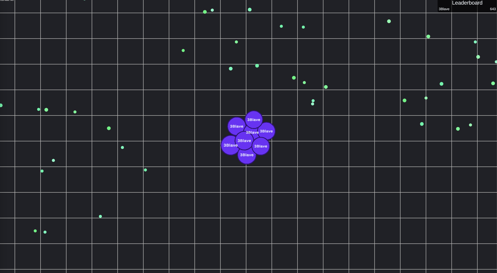
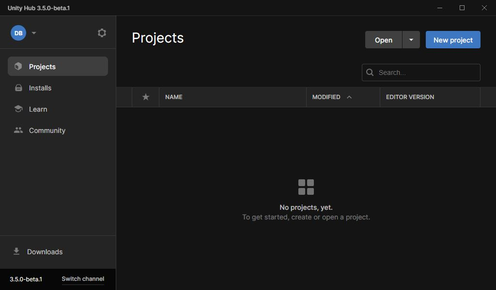
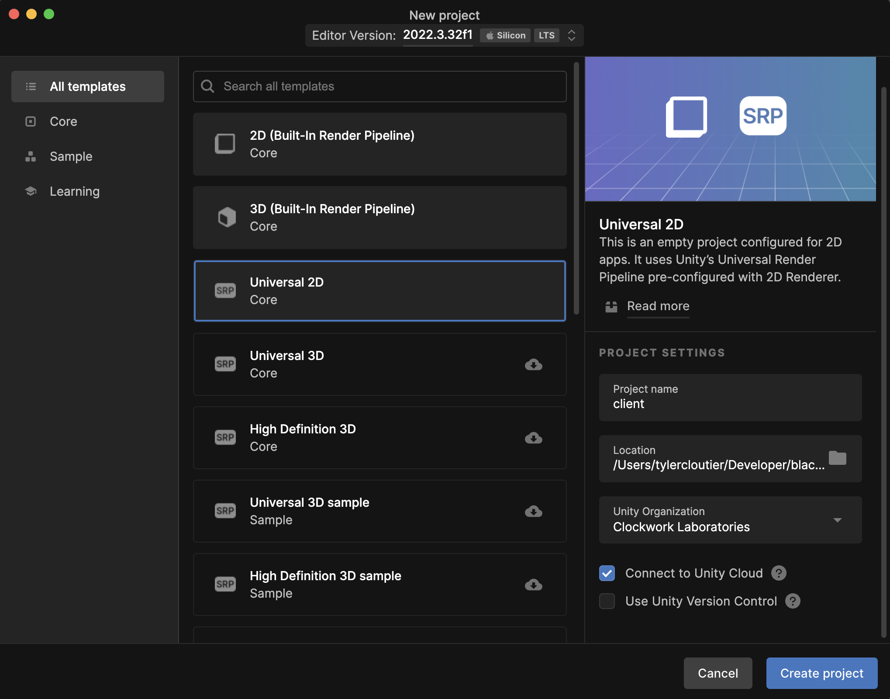

# Unity Tutorial - Part 1 - Setup



Need help with the tutorial? [Join our Discord server](https://discord.gg/spacetimedb)!

> A completed version of the game we'll create in this tutorial is available at:
>
> https://github.com/ClockworkLabs/Blackholio

## Prepare Project Structure

This project is separated into two subdirectories;

1. Server (module) code
2. Client code

First, we'll create a project root directory (you can choose the name):

```bash
mkdir blackholio
cd blackholio
```

We'll start by populating the client directory.

## Setting up the Tutorial Unity Project

In this section, we will guide you through the process of setting up a Unity Project that will serve as the starting point for our tutorial. By the end of this section, you will have a basic Unity project and be ready to implement the server functionality.

### Step 1: Create a Blank Unity Project

Open Unity and create a new project by selecting "New" from the Unity Hub or going to **File -> New Project**.



**⚠️ Important: Choose the `Universal 2D`** template to select a template which uses the Unity Universal Render Pipeline.

For `Project Name` use `client`. For Project Location make sure that you use your `blackholio` directory. This is the directory that we created in a previous step.



Click "Create" to generate the blank project.

### Import the SpacetimeDB Unity SDK

Add the SpacetimeDB Unity Package using the Package Manager. Open the Package Manager window by clicking on Window -> Package Manager. Click on the + button in the top left corner of the window and select "Add package from git URL". Enter the following URL and click Add.

```bash
https://github.com/clockworklabs/com.clockworklabs.spacetimedbsdk.git
```

The SpacetimeDB Unity SDK provides helpful tools for integrating SpacetimeDB into Unity, including a network manager which will synchronize your Unity client's state with your SpacetimeDB database in accordance with your subscription queries.

### Create the GameManager Script

1. In the Unity **Project** window, go to the folder where you want to keep your scripts (e.g., `Scripts` folder).
2. **Right-click** in the folder, then select `Create > C# Script` or in Unity 6 `MonoBehavior Script`.
3. Name the script `GameManager`.

The `GameManager` script will be where we will put the high level initialization and coordination logic for our game.

### Add the GameManager to the Scene

1. **Create an Empty GameObject**:
   - Go to the top menu and select **GameObject > Create Empty**.
   - Alternatively, right-click in the **Hierarchy** window and select **Create Empty**.

2. **Rename the GameObject**:
   - In the **Inspector**, click on the GameObject’s name at the top and rename it to `GameManager`.

3. **Attach the GameManager Script**:
   - Drag and drop the `GameManager` script from the **Project** window onto the `GameManager` GameObject in the **Hierarchy** window.
   - Alternatively, in the **Inspector**, click **Add Component**, search for `GameManager`, and select it.

### Add the SpacetimeDB Network Manager

The `SpacetimeDBNetworkManager` is a simple script which hooks into the Unity `Update` loop in order to drive the sending and processing of messages between your client and SpacetimeDB. You don't have to interact with this script, but it must be present on a single GameObject which is in the scene in order for it to facilitate the processing of messages.

When you build a new connection to SpacetimeDB, that connection will be added to and managed by the `SpacetimeDBNetworkManager` automatically.

Click on the `GameManager` object in the scene and click **Add Component**. Search for and select the `SpacetimeDBNetworkManager` to add it to your `GameManager` object.

Our Unity project is all set up! If you press play, it will show a blank screen, but it should start the game without any errors. Now we're ready to get started on our SpacetimeDB server module, so we have something to connect to!

### Create the Server Module

We've now got the very basics set up. In [part 2](part-2) you'll learn the basics of how how to create a SpacetimeDB server module and how to connect to it from your client.