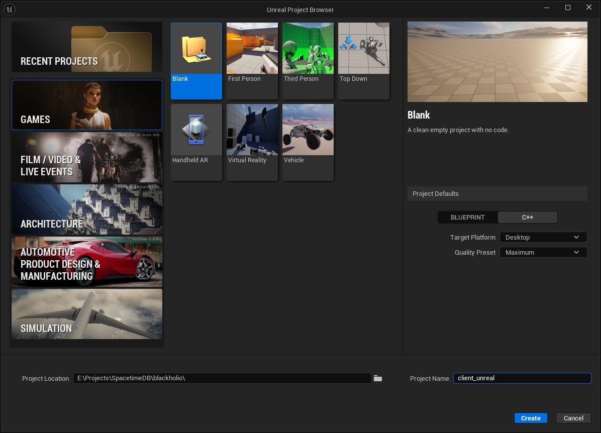

# Unreal Tutorial - Part 1 - Setup

Need help with the tutorial? [Join our Discord server](https://discord.gg/spacetimedb)!

> A completed version of the game we'll create in this tutorial is available at:
>
> https://github.com/clockworklabs/SpacetimeDB/tree/master/demo/Blackholio

## Prepare Project Structure

This project is separated into two subdirectories;

1. Server (module) code
2. Client code

First, we'll create a project root directory (you can choose the name):

```bash
mkdir blackholio
cd blackholio
```

We'll start by populating the client directory.

## Setting up the Tutorial Unreal Project

In this section, we will guide you through the process of setting up a Unreal Project that will serve as the starting point for our tutorial. By the end of this section, you will have a basic Unreal project and be ready to implement the server functionality.

### Step 1: Create a Blank Unreal Project

SpacetimeDB supports Unreal version `5.6` or later. See [the overview](.) for more information on specific supported versions.

Launch Unreal 5.6 and create a new project by selecting Games from the Unreal Project Browser.

**⚠️ Important: Select the Blank** template and in **Project Defaults select C++**. 

For `Project Name` use `client_unreal`. For Project Location make sure that you use your `blackholio` directory. This is the directory that we created in a previous step.

Click "Create" to generate the blank project.



### Import the SpacetimeDB Unreal SDK

We're working on hosting the SpacetimeDB SDK for Unreal, in the mean time you can download from GitHub:
> https://github.com/clockworklabs/SpacetimeDB/tree/master/sdks/unreal/src

> REVIEW: We need to decide how we'll share the SDK (eventually we should host with Fab.com and they can add it like any normal Unreal plugin)

Before beginning make sure to close the Unreal project and IDE.

Add the SpacetimeDB Unreal SDK by first adding a new plugin folder:
```bash
cd client_unreal
md Plugins
```
Copy the SpacetimeDbSdk to the new Plugins folder.
> You should have /client_unreal/Plugins/SpacetimeDbSdk

In the root of the Unreal project right click the client_unreal.uproject and select Generate Visual Studio project files. 


### Create the GameManager Actor

1. Open the client_unreal project, you should see a pop-up that requests to build SpacetimeDbSdk, accept that
2. Open `Tools > New C++ Class` in the top menu, select **Actor** as the parent and click **Next**
3. Select **Public** Class Type
4. Name the script `GameManager`.

The `GameManager` script will be where we will put the high level initialization and coordination logic for our game.

> Typically with Unreal you would use a Subsystem for this but to keep the tutorial simple we'll stick with a singleton actor.

### Setup the Level

Let's set up the basic level, add our new GameManager to the level and a little lighting cleanup for our 2D setup.

1. **Create a new Level**:
   - Open `File > New Level` in the top menu, and select Empty Level and click **Create**.
   - Save the level and name it `Blackholio`

2. **Create GameManager Blueprint**:
   - In the **Content Drawer**, click **Add**, select `Blueprint > Blueprint Class`
   - Expand **All Classes**, search for `GameManager`, highlight it, and click **Select**
   - Name the blueprint `BP_GameManager`

3. **Update Maps & Modes**:
   - Open `Edit > Project Settings` in the top menu, select `Project > Maps & Modes` on the left.
   - Update **Editor Startup Map** to the new `Blackholio` map
   - Update **Game Default Map** to the new `Blackholio` map


4. **Add to the Level**:
   - Drag and drop the `BP_GameManager` blueprint from the **Content Drawer** window into the scene view.

5. **Add a Directional Light**:
   - Click the **Add** button in the top toolbar, and select `Lights > Directional Light`
   - Update `Rotation` to -105.0, -31.0, -14.0

6. **Add a PostProcessVolume**:
   - Click the **Add** button in the top toolbar, and select `Volumes > Post Process Volume`
   - Enable and update `Exposure > Exposure Compensation` to 0.0
   - Enable and update `Exposure > Min EV100` to 1.0
   - Enable and update `Exposure > Max EV100` to 1.0
   - Enable `Post Process Volume Settings > Infinite Extend (Unbounded)`

### Add simple GameMode

We'll need a very simple GameMode to tweak the start up settings, let's add that now and wire it in for the World Settings.

1. **Create the C++ Class**:
   - Open `Tools > New C++ Class` in the top menu, select **GameModeBase** as the parent and click **Next**
   - Select **Public** Class Type
   - Name the script `BlackholioGameMode`

2. **Create GameMode Blueprint**:
   - In the **Content Drawer**, click **Add**, select `Blueprint > Blueprint Class`
   - Expand **All Classes**, search for `BlackholioGameMode`, highlight it, and click **Select**
   - Name the blueprint `BP_BlackholioGameMode`

3. **Update WorldSettings**:
   - Open `Window > World Settings` in the top menu
   - Update GameMode Override from **None** to **BP_BlackholioGameMode**
   - Save the level

The foundation for our Unreal project is all set up! If you press play, it will show a blank screen, but it should start the game without any errors. Now we're ready to get started on our SpacetimeDB server module, so we have something to connect to!

### Create the Server Module

We've now got the very basics set up. In [part 2](part-2) you'll learn the basics of how to create a SpacetimeDB server module and how to connect to it from your client.
