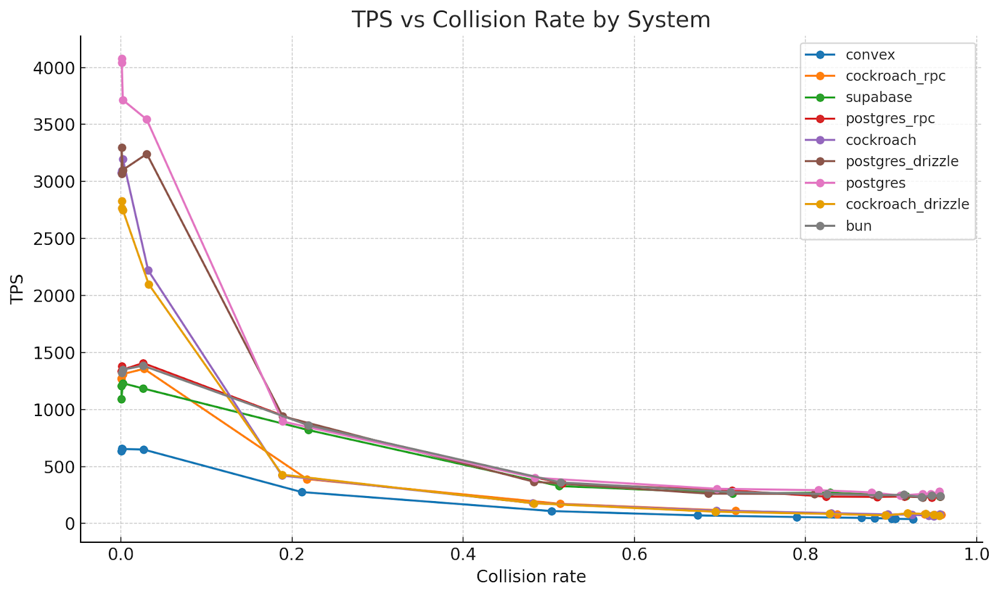

# SpacetimeDB Benchmark Suite

A benchmark suite comparing SpacetimeDB against traditional web application stacks for transactional workloads.

## Quick Demo

See SpacetimeDB's performance advantage with one command:

```bash
npm install
npm run demo
```

The demo compares SpacetimeDB and Convex by default, since both are easy for anyone to set up and run locally without additional infrastructure. Other systems (Postgres, CockroachDB, SQLite, etc.) are also supported but require more setup. The demo checks that required services are running (prompts you to start them if not), seeds databases, and displays animated results.

**Options:** `--systems a,b,c` | `--seconds N` | `--skip-prep` | `--no-animation`

**Note:** You will need to [install Rust](https://rust-lang.org/tools/install/) to run the spacetimedb benchmark, because we run a [Rust Client](#rust-client).

## Results Summary

All tests use 50 concurrent connections with a transfer workload (read-modify-write transaction between two accounts).

| System                            | TPS (~0% Contention) | TPS (~80% Contention) |
| --------------------------------- | -------------------- | --------------------- |
| **SpacetimeDB**                   | **107,850**          | **103,590**           |
| SQLite + Node HTTP + Drizzle      | 7,845                | 7,652                 |
| Bun + Drizzle + Postgres          | 7,115                | 2,074                 |
| Postgres + Node HTTP + Drizzle    | 6,429                | 2,798                 |
| Supabase + Node HTTP + Drizzle    | 6,310                | 1,268                 |
| CockroachDB + Node HTTP + Drizzle | 5,129                | 197                   |
| PlanetScale + Node HTTP + Drizzle | 477                  | 30                    |
| Convex                            | 438                  | 58                    |

**Key Finding:** SpacetimeDB achieves **~14x higher throughput** than the next best option (SQLite RPC) and maintains nearly identical performance under high contention (only ~4% drop), while traditional databases suffer significant degradation (CockroachDB drops 96%).

> **Note:** SpacetimeDB runs on ARM architectures (including Apple M-series Macs), but has not yet been optimized for them.

### Contention Impact



The chart above shows TPS vs Zipf Alpha (contention level). Higher alpha values concentrate more transactions on fewer "hot" accounts, increasing contention. SpacetimeDB maintains consistent performance regardless of contention level, while traditional database architectures show significant degradation.

## Methodology

All systems were tested with **out-of-the-box default settings** - no custom tuning, no configuration optimization. This reflects what developers experience when they first adopt these technologies.

For cloud services, we tested paid tiers to give them their best chance:

- **PlanetScale**: PS-2560 (32 vCPUs, 256 GB RAM), single node, us-central1.
- **Supabase**: Pro tier
- **Convex**: Pro tier

### Test Architecture

All benchmarks follow an **apples-to-apples** comparison using the same architecture pattern:

```
Client → Web Server (HTTP) → ORM (Drizzle) → Database
```

Or for integrated platforms (SpacetimeDB, Convex):

```
Client → Integrated Platform (compute + storage colocated)
```

This ensures we're measuring real-world application performance, not raw database throughput.

### The Transaction

Each transaction performs a **fund transfer** between two accounts:

1. Read both source and destination account balances
2. Verify sufficient funds in source account
3. Debit source account
4. Credit destination account
5. Commit transaction with row-level locking

This is a classic read-modify-write workload that tests transactional integrity under concurrent access.

### Test Command

```bash
docker compose run --rm bench --seconds 10 --concurrency 50 --alpha XX --connectors YY
```

- `--seconds 10`: Duration of benchmark run
- `--concurrency 50`: Number of concurrent client connections
- `--alpha 0`: ~0% contention (uniform account distribution)
- `--alpha 1.5`: ~80% contention (Zipf distribution concentrating on hot accounts)

### Hardware Configuration

**Server Machine (Variant A - PhoenixNAP):**

- s3.c3.medium bare metal instance - Intel i9-14900k 24 cores (32 threads), 128GB DDR5 Memory OS: Ubuntu 24.04

**Server Machine (Variant B - Google Cloud):**

- c4-standard-32-lssd (32 vCPUs, 120 GB Memory) OS: Ubuntu 24.04
- RAID 0 on 5 Local SSDs
- Region: us-central1

**Client Machine:**

- c4-standard-32 (32 vCPUs, 120 GB Memory) OS: Ubuntu 24.04
- Region: us-central1
- Runs on a **separate machine** from the server

**Note:** All services (databases, web servers, benchmark runner) except Convex local dev backend run in the same Docker environment on the server machine.

### Why Separate Client Machines?

Running clients on separate machines ensures:

- Network round-trip latency is measured (realistic production scenario)
- Client CPU/memory doesn't compete with server resources
- Results reflect actual deployment conditions

### Account Seeding

- 100,000 accounts seeded before each benchmark
- Initial balance: 10,000,000 per account
- Zipf distribution controls which accounts are selected for transfers

## Technical Notes

### Why SpacetimeDB Outperforms Traditional Stacks

The primary bottleneck in traditional web application architectures is the **round-trip latency between the application server and database**:

```
Traditional: Client → Server → Database → Server → Client
                        ↑___________↑
                     Network round-trip per query
```

SpacetimeDB eliminates this by **colocating compute and storage**:

```
SpacetimeDB: Client → SpacetimeDB (compute + storage) → Client
```

This architectural difference means SpacetimeDB can execute transactions in microseconds rather than milliseconds, resulting in order-of-magnitude performance improvements.

### Client Pipelining

The benchmark supports **pipelining** for all clients - sending multiple requests without waiting for responses. This maximizes throughput by keeping connections saturated.

### Confirmed Reads (`withConfirmedReads`)

SpacetimeDB supports `withConfirmedReads` mode which ensures transactions are durably committed before acknowledging to the client. The benchmark results shown use `withConfirmedReads = ON` for fair comparison with databases that provide similar durability guarantees.

### Cloud vs Local Results

PlanetScale results (~477 TPS) demonstrate the **significant impact of cloud database latency**. When the database is accessed over the network (even within the same cloud region), round-trip latency dominates performance. This is why SpacetimeDB's colocated architecture provides such dramatic improvements.

### Rust client

When running the benchmark for SpacetimeDB on higher-end hardware we found out that we were actually bottlnecked
on our test TypeScript client. To get the absolute most out of the performance of SpacetimeDB we wrote a custom
Rust client that allows us to send a much larger number of requests then we could otherwise. We didn't do this
for the other backends/databases as they maxed out before the client.

## Systems Tested

| System                            | Architecture                                            |
| --------------------------------- | ------------------------------------------------------- |
| SpacetimeDB                       | Integrated platform (Rust)                              |
| SQLite + Node HTTP + Drizzle      | Node.js HTTP server → Drizzle ORM → SQLite              |
| Bun + Drizzle + Postgres          | Bun HTTP server → Drizzle ORM → PostgreSQL              |
| Postgres + Node HTTP + Drizzle    | Node.js HTTP server → Drizzle ORM → PostgreSQL          |
| Supabase + Node HTTP + Drizzle    | Node.js HTTP server → Drizzle ORM → Supabase (Postgres) |
| CockroachDB + Node HTTP + Drizzle | Node.js HTTP server → Drizzle ORM → CockroachDB         |
| PlanetScale + Node HTTP + Drizzle | Node.js HTTP server → Drizzle ORM → PlanetScale (Cloud) |
| Convex                            | Integrated platform                                     |

## Running the Benchmarks

See [DEVELOP.md](./DEVELOP.md) for detailed setup and execution instructions.

### Quick Start

```bash
# Install dependencies
pnpm install

# Copy environment config
cp .env.example .env

# Start services (PostgreSQL, CockroachDB, etc.)
docker compose up -d pg crdb

# Seed databases
npm run prep

# Run benchmark
npm run bench -- --seconds 10 --concurrency 50 --alpha 0 --connectors spacetimedb,postgres_rpc,sqlite_rpc
```

## Output

Benchmark results are written to `./runs/` as JSON files with TPS and latency statistics.

## License

See repository root for license information.
